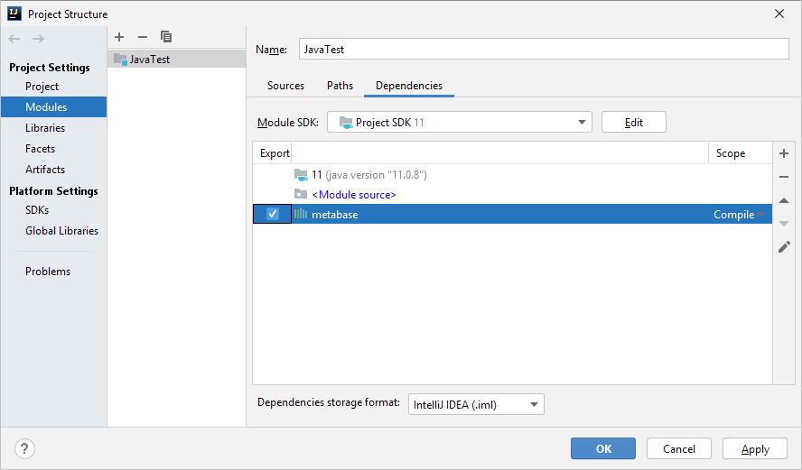

# Работа в Java

Работа в Java
-

# Работа в Java

Язык Java является кросс-платформенным языком программирования. Для
 взаимодействия с Java в «Форсайт. Аналитическая платформа»
 был создан специальный набор внешних библиотек. Данные библиотеки позволяют
 работать с ядром «Форсайт. Аналитическая платформа».
 В Java не поддерживается работа с Fore-формами, компонентами или окнами, доступными в «Форсайт. Аналитическая платформа».
 Для создания визуальной части необходимо использовать ресурсы самого языка
 Java.

## Подключение сборок

Для подключения внешней сборки зайдите в структуру разрабатываемого
 Java-проекта, перейдите на вкладку «Modules», нажмите кнопку  и выберите команду «Library
 > Java». В открывшемся диалоге перейдите в папку с установленным продуктом
 «Форсайт. Аналитическая платформа»
 и в подкаталоге «..\Interops\java\» выберите jar-файл с внешней сборкой,
 которая соответствует требуемой [Fore-сборке](Assembly.chm::/System_Assembly.htm).
 Подтвердите выбор в окне конфигурации сборки. В окне структуры проекта
 установите флажки напротив добавленной сборки и нажмите кнопку «Apply».
 После этого ресурсы добавленной внешней сборки будут доступны для использования
 в коде на Java.

Если предполагается использовать множество сборок, то можно добавить
 путь до папки с библиотеками, а не добавлять каждый jar-файл отдельно.
 Для этого нажмите кнопку , выполните команду «JARs
 or directories...» и укажите путь до jar-файлов, например «c:\Program
 Files\Foresight\Analytics Platform 10.x\Interops\java\».

В коде пропишите строку импорта типов из внешней сборки в одном из следующих
 форматов:

import foresight.<имя сборки>.*; //Импорт содержимого указанной сборки
import foresight.<имя сборки>.<имя типа>.*; //Импорт содержимого указанного класса/интерфейса
Примечание.
 Если разработка осуществляется в средах разработки, которые не поддерживают
 указание пути до внешних используемых jar-файлов, то укажите данный путь
 в системной переменной Path.

## Преобразование кода

При создании внешних сборок для использования в Java происходит специальное
 преобразование системных классов, интерфейсов, перечислений и других типов.
 Поэтому при создании кода на Java с использованием ресурсов «Форсайт. Аналитическая платформа»
 необходимо учитывать следующие изменения:

	- Все методы имеют два варианта вызова:

		- <имя метода>(<параметры>,
		 Object [] objects). В таком варианте objects - это массив,
		 в первый элемент которого сохраняется результат вызова метода;

		- do<имя метода>([<параметры>]).
		 В таком варианте результат находится в возвращаемом значении.
		 Рекомендуется использовать данный вариант.

	- Свойствам сопоставлены методы в следующих форматах:

		- get<имя свойства>([<параметры>])
		 и set<имя свойства>([<параметры>]).
		 Get - получает, а Set - устанавливает значение свойства;

		- get_<имя свойства>([<параметры>],
		 Object [] objects) и put_<имя
		 свойства>(<значение>). Get возвращает значение
		 свойства в первый элемент массива. Put устанавливает значение
		 и возвращает код ошибки, если установка не удалась.

	- К именам классов добавлена буква C, например: классу MetabaseManagerFactory
	 в Fore соответствует CMetabaseManagerFactory
	 в Java.

	- Для создания объекта нужного класса используется конструкция
	 <Имя класса>.Create()
	 или <Имя класса>.Create<имя
	 интерфейса>() без ключевого слова new.

	- Обращение к элементам перечислений осуществляется стандартным
	 образом: <Имя перечисления>.<Имя элемента перечисления>.
	 Если нужно привести элемент перечисления к целочисленному типу, то
	 необходимо использовать метод swigValue().

	- Для приведения типов необходимо создавать объект нужного типа
	 через new и передавать имеющийся
	 объект как параметр, например:

ICredentials creds;
...
IPasswordCredentials pswdCreds = new IPasswordCredentials(creds);

## Пример

Пример подключения к репозиторию в коде на Java:

import foresight.metabase.*; //Импорт содержимого всей сборки

public class Main {
    public static void main(String[] args) {
        IMetabaseManager mbMan = CMetabaseManagerFactory.Create().getActive();
        IMetabaseDefinitions mbDefs = mbMan.getDefinitions();
        mbDefs.ReadFromRegistry();
        IMetabaseDefinition mbDef = mbDefs.doFindById("FPRepository");
        ISecurityPackage pack = mbDef.Packs.FindById(mbDef.get_SecurityPackage()).Package;
        ICredentials creds = pack.doCreateCredentials(AuthenticationMode.amPassword);
        IPasswordCredentials pswdCreds = new IPasswordCredentials(creds);
        pswdCreds.put_UserName("user");
        pswdCreds.put_Password("password");
        IMetabase mb = mbDef.doOpenDefault(pswdCreds);
        // Выведем наименование репозитория
        System.out.println(mb.getName());
    }
}
См. также:

[Использование
 ресурсов продукта в сторонних приложениях](../KnowledgeBase_KB000029.htm)

		Справочная
		 система на версию 10.9
		 от 18/08/2025,
		 © ООО «ФОРСАЙТ»,
