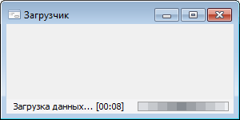

# Индикация длительных процессов

Индикация длительных процессов
-

# Индикация длительных процессов

	Номер статьи: KB000001

## Общие сведения

	Связанные блоки:

		- [среда
		 разработки](Developer.chm::/About_Developing/Start_the_Development_Environment.htm)

		- [Fore](Fore.chm::/Fore_Title.htm)

## Описание

	Для индикации длительных процессов при разработке собственных форм
	 в Fore существует два метода:

		- Использовать статическое свойство [WaitCursor](uilib.chm::/interface/iwinapplicationclass/iwinapplicationclass.waitcursor.htm)
		 класса [Ui.WinApplication](uilib.chm::/class/winapplication/winapplication.htm).
		 При установке его в True
		 отображается курсор «песочные часы» (), при
		 установке его в False
		 возвращается прежний курсор.

	Пример кода:

		Sub OperationX;

		Begin

		    WinApplication.WaitCursor := True;

		    Try

		        // Длительная операция

		    Finally

		        WinApplication.WaitCursor := False;

		    End Try;

		End Sub OperationX;

		- Использовать методы [BeginOperation](modforms.chm::/interface/iformcontrol/iformcontrol.beginoperation.htm)
		 и [EndOperation](modforms.chm::/interface/iformcontrol/iformcontrol.endoperation.htm)
		 у объекта формы. При вызове метода BeginOperation
		 отображается стандартный анимированный индикатор процесса в нижней
		 части формы с заданным разработчиком текстом, например:

		

	После завершения операции необходимо
	 вызвать метод EndOperation,
	 который вернет форму в прежнее состояние.

	Пример кода:

		Sub OperationY;

		Begin

		    BeginOperation(NotificationEdit.Text);

		    Try

		        // Длительная операция

		    Finally

		        EndOperation;

		    End Try;

		End Sub OperationY;

	Данные методы необходимо использовать в операторе Try … Except …
	 Finally … End Try для корректного завершения длительного процесса
	 в случае возникновения [исключительной
	 ситуации](fore.chm::/10_processing_exceptions/processing_the_exceptions.htm).

См. также:

[База
 знаний разработчиков](../KnowledgeBase_Intro.htm)

		Справочная
		 система на версию 10.9
		 от 18/08/2025,
		 © ООО «ФОРСАЙТ»,
