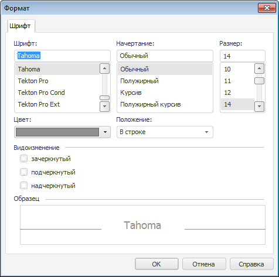

# Использование форматированного текста

Использование форматированного текста
-

# Использование форматированного текста

	Номер статьи: KB000034

## Описание

	В различных элементах объектов платформы, предназначенных для отображения
	 какого-либо текста, реализовано использование RTF-редактора. RTF-представление
	 позволяет производить более детальную настройку оформления текста
	 (настраивать оформление отдельных частей текста). Также различные
	 заголовки, поддерживающие интерфейс [IGxTitle](ModDrawing.chm::/Interface/IGxTitle/IGxTitle.htm),
	 могут хранить настройки оформления в форматах XAML или HTML.

	Примечание.
	 Формат XAML более не поддерживается для хранения значений форматированного
	 текста. При указании значений в формате XAML они автоматически будут
	 преобразованы в формат RTF. Также будут преобразовываться старые значения,
	 хранящиеся в формате XAML.

	Следующие элементы поддерживают использование форматированного текста:

			 Элемент, использующий форматированный текст
			 Свойство Fore

			 Ячейки таблиц регламентного отчета
			 [ITabRange.Text](TabSheet.chm::/Interface/ITabRange/ITabRange.Text.htm)
			 в сочетании со свойствами [ITabRange.IsRtfText](TabSheet.chm::/Interface/ITabRange/ITabRange.IsRtfText.htm)

			 Заголовок диаграммы и ее оси
			 [IChartCaption.FormattedText](Chart.chm::/Interface/IChartCaption/IChartCaption.FormattedText.htm)

			 Метки на диаграмме
			 [IChartLabel.FormattedText](Chart.chm::/Interface/IChartLabel/IChartLabel.FormattedText.htm)

			 Текст в фигурах рабочего пространства
			 [IWxShape.FormattedText](Andy.chm::/Interface/IWxShape/IWxShape.FormattedText.htm)

			 Заголовки, поддерживающие интерфейс [IGxTitle](ModDrawing.chm::/Interface/IGxTitle/IGxTitle.htm)
			 [IGxTitle.FormattedText](ModDrawing.chm::/Interface/IGxTitle/IGxTitle.FormattedText.htm),
			 [IGxTitle.FormattedTitle](ModDrawing.chm::/Interface/IGxTitle/IGxTitle.FormattedTitle.htm),
			 [IGxTitle.HtmlText](ModDrawing.chm::/Interface/IGxTitle/IGxTitle.HtmlText.htm),
			 [IGxTitle.HtmlTitle](ModDrawing.chm::/Interface/IGxTitle/IGxTitle.HtmlTitle.htm)

## Настройка форматированного текста в пользовательском интерфейсе

	Для настройки оформления блока текста выделите необходимый текст
	 и в контекстном меню выполните команду «Формат»:

	

	Открывшийся диалог идентичен диалогам настройки параметров текста,
	 но в нем доступны для использования дополнительные шрифты, которые
	 могут быть отрисованы с помощью технологии WPF.

	Важно.
	 При изменении размера текста с установленным форматированием не учитываются
	 пробелы, которые могут быть в конце текста. В связи с этим может некорректно
	 рассчитываться размер рабочей области элемента, в котором будет отображаться
	 форматированный текст.

## Настройка форматированного текста
	 с использованием Fore

	Для установки форматированного текста через Fore
	 задайте значение свойства для соответствующего элемента. Список доступных
	 свойств указан в таблице выше. В зависимости от того, в каком формате
	 указывается текст, учитывайте особенности форматов, описанные ниже.

### XAML

	В качестве значения задается текст, представляющий собой разметку
	 на языке XAML, представленную в виде настроек элемента «TextBlock»:

	"<?xml version=""1.0"" encoding=""utf-16""?>

	<TextBlock FontFamily=""Arial"" FontStyle=""Normal"" FontWeight=""Bold"" FontSize=""13.3333333333333""

	xmlns=""http://schemas.microsoft.com/winfx/2006/xaml/presentation"">Очень<LineBreak />

	<Run FontSize=""15.3333333333333"" Foreground=""#FF366092"">Важный</Run><LineBreak />

	<Run Foreground=""#FFE26B0A"" FontSize=""18.3333333333333"">Заголовок</Run></TextBlock>";

	Общие атрибуты для оформления всего блока текста настраиваются для
	 элемента TextBlock, который
	 может включать в себя:

		- сам текст, который берет общие атрибуты оформления;

		- разрывы строк <LineBreak/>;

		- блоки, с отличающимся оформлением текста - элементы Run.

	Примечание.
	 Элементы TextBlock и Run имеют одинаковые атрибуты для
	 настройки текста. Атрибуты элемента Run
	 перекрывают схожие атрибуты элемента TextBlock.

	Обязательный атрибут элемента TextBlock
	 - xmlns. Он определяет
	 пространство имен WPF. Описание используемого элемента [TextBlock](http://msdn.microsoft.com/ru-ru/library/vstudio/bb613554(v%3dvs.90).aspx)
	 представлено в MSDN. При составлении разметки можно руководствоваться
	 описанием класса [System.Windows.Controls.Textblock](http://msdn.microsoft.com/ru-ru/library/vstudio/system.windows.controls.textblock(v%3dvs.90).aspx).

### HTML

	В качестве значения задается текст, представляющий собой разметку
	 на языке HTML. Основным элемент разметки является элемент ....
	 Форматированный текст будет являться комбинацией элементов :

	

	Очень 

	Важный 

	Заголовок

### RTF

	Для представления форматированного текста в формате RTF требуется
	 знание спецификации этого формата. Подобными знаниями в основном обладают
	 разработчики, имеющие дело с различными текстовыми редакторами. В
	 Fore для преобразования текста
	 в различные форматы, был разработан специальный класс [TextConverter](ForeSys.chm::/Class/TextConverter/TextConverter.htm).
	 Используя его метод Export, можно получить RTF-представление, например,
	 из имеющегося HTML-представления форматированного текста. Ниже приведен
	 пример функции, которая осуществляет такое преобразование:

	Function HtmlToRtf(html: String): String;

	Var

	    Converter: ITextConverter;

	Begin

	    Converter := New TextConverter.Create;

	    Return Converter.Export(html, TextFormat.Rtf);

	End Function HtmlToRtf;

См. также:

[База
 знаний разработчиков](../KnowledgeBase_Intro.htm)

		Справочная
		 система на версию 10.9
		 от 18/08/2025,
		 © ООО «ФОРСАЙТ»,
