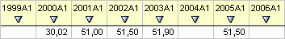
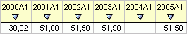
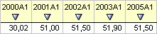

# LnSuppressEmptyArea

LnSuppressEmptyArea
-

# LnSuppressEmptyArea

## Описание

Перечисление LnSuppressEmptyArea
 содержит типы областей фильтрации пустых ячеек.

Используется следующими свойствами и методами:

	- [ILanerFilter.SuppressEmptyArea](../Interface/ILanerFilter/ILanerFilter.SuppressEmptyArea.htm);

	- [IMsMetaModelVisualController.GetGroupVariablesData](kems.chm::/Interface/IMsMetaModelVisualController/IMsMetaModelVisualController.GetGroupVariablesData.htm).

## Допустимые значения

		 Значение
		 Краткое описание

		 1
		 SerieBounds. Фильтрация
		 будет скрывать ячейки только слева и справа от данных ряда.

		 2
		 FullSerie. Фильтрация
		 будет скрывать ячейки как с концов, так и внутри данных ряда.

## Комментарии

Ряд без фильтрации:

SerieBounds:

FullSerie:

См. также:

[Перечисления
 сборки Laner](Laner_Enums.htm)

		Справочная
		 система на версию 10.9
		 от 18/08/2025,
		 © ООО «ФОРСАЙТ»,
