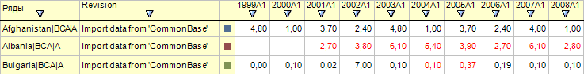

# ILaner.CurrentRevision

ILaner.CurrentRevision
-

# ILaner.CurrentRevision

## Синтаксис

CurrentRevision: [IRubricatorRevision](KeCubes.chm::/Interface/IRubricatorRevision/IRubricatorRevision.htm);

## Описание

Свойство CurrentRevision определяет
 текущую ревизию ряда.

## Комментарии

Если текущая ревизия не определена, то в таблице отображаются актуальные
 данные. Красным шрифтом будут выделены данные, измененные в текущей ревизии.
 Например:

## Пример

Для выполнения примера предполагается наличие на форме компонентов Button,
 TabSheetBox, UiErAnalyzer с наименованиями Button1, TabSheetBox1 и UiErAnalyzer1
 соответственно. UiErAnalyzer1 является источником данных для TabSheetBox1.
 В UiErAnalyzer1 должна быть загружена рабочая область базы данных временных
 рядов.

Пример является обработчиком события OnClick для компонента Button1.

Добавьте ссылки на системные сборки: Cubes, Dimensions, Express, ExtCtrls,
 Forms, Laner, Tab.

	Sub Button1OnClick(Sender: Object; Args: IMouseEventArgs);

	Var

	    RubInstance: IRubricatorInstance;

	    RevDims: IDimInstance;

	    ElemArray: IDimElementArray;

	    RevKey: Integer;

	    Elem: Integer;

	    crRev: IRubricatorRevision;

	    Eax: IEaxAnalyzer;

	    Laner: ILaner;

	Begin

	    Laner := UiErAnalyzer1.ErAnalyzer.Laner;

	    RubInstance := Laner.RubricatorInstance;

	    RevDims := RubInstance.RevisionsDimension(-2);

	    ElemArray := RevDims.Elements.Elements;

	    If ElemArray.Count > 0 Then

	        Elem := ElemArray.Element(0);

	        RevKey := RevDims.Indexes.PrimaryIndex.IndexAttributesValues(Elem);

	        crRev := RubInstance.GetRevision(RevKey);

	        Eax := UiErAnalyzer1.ErAnalyzer;

	        Laner.CurrentRevision := crRev;

	        Laner.TransformationHistory := True;

	    End If;

	End Sub Button1OnClick;

После выполнения примера в таблице данных будут отображены данные, соответствующие
 последней версии (ревизии) показателя. При наведении указателя мыши на
 ячейку с данными, будет отображена всплывающая подсказка с наименованием
 ревизии, в которой были произведены первые изменения показателя.

См. также:

[ILaner](ILaner.htm)

		Справочная
		 система на версию 10.9
		 от 18/08/2025,
		 © ООО «ФОРСАЙТ»,
