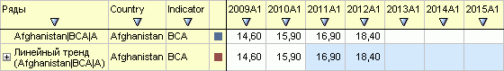

# ILaner.DisplayDataAs

ILaner.DisplayDataAs
-

# ILaner.DisplayDataAs

## Синтаксис

DisplayDataAs: [LnDataDisplayType](../../Enums/LnDataDisplayType.htm);

## Описание

Свойство DisplayDataAs определяет
 режим отображения значений для вычисляемых рядов.

## Комментарии

Режим отображения определяется значением перечисления [LnDataDisplayType](../../Enums/LnDataDisplayType.htm):

	- LnDataDisplayType.CalculatedValues.
	 В рабочей книге отображаются рассчитанные значения ряда:

	- LnDataDisplayType.SourceValues.
	 В рабочей книге отображаются значения, хранящиеся в БД, при этом подсвечены
	 ячейки, хранимые значения которых отличаются от рассчитанных:

## Пример

Для выполнения примера предполагается наличие на форме компонентов Button,
 LanerBox, UiErAnalyzer с наименованиями Button1, LanerBox1 и UiErAnalyzer1
 соответственно. UiErAnalyzer1 является источником данных для LanerBox1.
 В UiErAnalyzer1 должна быть загружена рабочая область базы данных временных
 рядов.

Пример является обработчиком события OnClick для компонента Button1.

Добавьте ссылки на системные сборки: Express, ExtCtrls, Forms, Laner,
 Tab.

	Sub Button1OnClick(Sender: Object; Args: IMouseEventArgs);

	Var

	    Analyzer: IEaxAnalyzer;

	    pLaner: ILaner;

	Begin

	    Analyzer := UiErAnalyzer1.ErAnalyzer;

	    pLaner := Analyzer.Laner;

	    pLaner.DisplayDataAs := LnDataDisplayType.CalculatedValues;

	End Sub Button1OnClick;

После выполнения примера в рабочей книге будут отображены рассчитанные
 значения вычисляемых рядов.

См. также:

[ILaner](ILaner.htm)

		Справочная
		 система на версию 10.9
		 от 18/08/2025,
		 © ООО «ФОРСАЙТ»,
