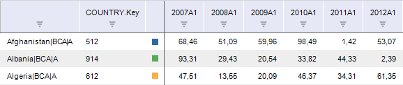

# ILanerAttributeColumn.NamingFormat

ILanerAttributeColumn.NamingFormat
-

# ILanerAttributeColumn.NamingFormat

## Синтаксис

NamingFormat: String;

## Описание

Свойство NamingFormat определяет
 формат наименования отображаемого атрибута.

## Комментарии

Наименование задается строкой следующего вида: <Rubr_Attr>.<Dict_Attr>,
 где:

	- <Rubr_Attr>. Идентификатор
	 атрибута базы данных временных рядов, являющегося ссылкой на справочник;

	- <Dict_Attr>. Идентификатор
	 атрибута справочника, на который ссылается атрибут базы данных временных
	 рядов <Rubr_Attr>.

Например, БД временных рядов содержит атрибут «COUNTRY», ссылающийся
 на справочник. Для данного справочника настроено отображение атрибута
 «KEY»:

## Пример

Для выполнения примера предполагается наличие на форме компонентов Button,
 LanerBox, UiErAnalyzer с наименованиями Button1, Memo1, LanerBox1 и UiErAnalyzer1
 соответственно. UiErAnalyzer1 является источником данных для LanerBox1.
 В UiErAnalyzer1 должна быть загружена рабочая область базы данных временных
 рядов. В базе присутствует атрибут показателей «COUNTRY», являющийся
 ссылкой на справочник.

Пример является обработчиком события OnClick для компонента Button1.

Добавьте ссылки на системные сборки: Express, ExtCtrls, Forms, Laner,
 Tab.

	Sub Button1OnClick(Sender: Object; Args: IMouseEventArgs);

	Var

	    ErAn: IEaxAnalyzer;

	    Laner: ILaner;

	    LanerAttr: ILanerAttributeColumns;

	    LanerA: ILanerAttributeColumn;

	Begin

	    ErAn := UiErAnalyzer1.ErAnalyzer;

	    Laner := ErAn.Laner;

	    Laner.BeginUpdate;

	    // Отображение дополнительного атрибута

	    LanerAttr := Laner.AttributeColumns;

	    LanerA := LanerAttr.AddByType(LnColumnType.Attribute) As ILanerAttributeColumn;

	    LanerA.NamingFormat := "COUNTRY.KEY";

	    Laner.EndUpdate;

	End Sub Button1OnClick;

Результат выполнения процедуры: в рабочей книге отображаются значения
 атрибута, являющегося ключом справочника, на который ссылается атрибут
 показателей «COUNTRY».

См. также:

[ILanerAttributeColumn](ILanerAttributeColumn.htm)

		Справочная
		 система на версию 10.9
		 от 18/08/2025,
		 © ООО «ФОРСАЙТ»,
