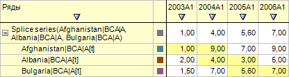

# ILanerCellStyle.SetDefault

ILanerCellStyle.SetDefault
-

# ILanerCellStyle.SetDefault

## Синтаксис

SetDefault;

## Описание

Метод SetDefault устанавливает
 стиль ячеек, используемый по умолчанию.

## Пример

Для выполнения примера предполагается наличие на форме компонентов Button,
 TabSheetBox, UiErAnalyzer с наименованиями Button1, TabSheetBox1 и UiErAnalyzer1
 соответственно. UiErAnalyzer1 является источником данных для TabSheetBox1.
 В UiErAnalyzer1 должна быть загружена рабочая область базы данных временных
 рядов, содержащая совмещенный ряд.

Пример является обработчиком события OnClick для компонента Button1.

Добавьте ссылки на системные сборки: Express, ExtCtrls, Forms, Laner,
 Tab.

	Sub Button1OnClick(Sender: Object; Args: IMouseEventArgs);

	Var

	    ErAnalyzer: IEaxAnalyzer;

	    Laner: ILaner;

	    Style: ILanerCellStyle;

	    Grid: IEaxGrid;

	Begin

	    ErAnalyzer := UiErAnalyzer1.ErAnalyzer;

	    Laner := ErAnalyzer.Laner;

	    Style := Laner.CellStyle(LnCellType.Splice);

	    Style.SetDefault;

	    Grid := ErAnalyzer.Grid;

	    Grid.Refresh;

	End Sub Button1OnClick;

После выполнения примера для ячеек рядов, которые являются дочерними
 для результирующего совмещенного ряда, оформление будет изменено на оформление,
 используемое по умолчанию:

См. также:

[ILanerCellStyle](ILanerCellStyle.htm)

		Справочная
		 система на версию 10.9
		 от 18/08/2025,
		 © ООО «ФОРСАЙТ»,
