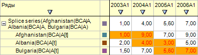

# ILanerCellStyle.TabStyle

ILanerCellStyle.TabStyle
-

# ILanerCellStyle.TabStyle

## Синтаксис

TabStyle: [ITabCellStyle](TabSheet.chm::/Interface/ITabCellStyle/ITabCellStyle.htm);

## Описание

Свойство TabStyle возвращает
 стиль оформления ячейки рабочей книги.

## Комментарии

По умолчанию TabStyle содержит
 пустой откреплённый стиль.

## Пример

Для выполнения примера предполагается наличие на форме компонентов Button,
 LanerBox, UiErAnalyzer с наименованиями Button1, LanerBox1 и UiErAnalyzer1
 соответственно. UiErAnalyzer1 является источником данных для LanerBox1.
 В UiErAnalyzer1 должна быть загружена рабочая область базы данных временных
 рядов.

Пример является обработчиком события OnClick для компонента Button1.

Добавьте ссылки на системные сборки: Express, ExtCtrls, Forms, Laner,
 Tab.

	Sub Button1OnClick(Sender: Object; Args: IMouseEventArgs);

	Var

	    ErAnalyzer: IEaxAnalyzer;

	    Laner: ILaner;

	    Style: ILanerCellStyle;

	    TabSt: ITabCellStyle;

	    Grid: IEaxGrid;

	Begin

	    ErAnalyzer := UiErAnalyzer1.ErAnalyzer;

	    Laner := ErAnalyzer.Laner;

	    Style := Laner.CellStyle(LnCellType.Splice);

	    TabSt := Style.TabStyle;

	    // Изменяем цвет шрифта на красный

	    TabSt.Font.Color := GxColor.FromName("Red");

	    // Изменяем цвет фона ячеек на оранжевый

	    TabSt.BackgroundColor := GxColor.FromName("Orange");

	    // Изменяем шрифт на «Arial»

	    TabSt.Font.Name := "Arial";

	    Grid := ErAnalyzer.Grid;

	    Grid.Refresh;

	End Sub Button1OnClick;

После выполнения примера будет изменено оформление для ячеек рядов,
 которые являются дочерними для результирующего совмещенного ряда:

См. также:

[ILanerCellStyle](ILanerCellStyle.htm)

		Справочная
		 система на версию 10.9
		 от 18/08/2025,
		 © ООО «ФОРСАЙТ»,
