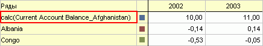

# ILanerHeader.ReadOnly

ILanerHeader.ReadOnly
-

# ILanerHeader.ReadOnly

## Синтаксис

ReadOnly(SlotIndex: Integer, ElementIndex: Integer):
 Boolean;

## Параметры

SlotIndex. Индекс слота в заголовке;

ElementIndex. Индекс элемента
 в заголовке.

## Описание

Свойство ReadOnly возвращает
 признак того, возможно ли редактирование элемента заголовка.

## Комментарии

True - значение атрибута доступно
 только для чтения.

## Пример

Для выполнения примера предполагается наличие на форме компонентов Button,
 TabSheetBox, UiErAnalyzer с наименованиями Button1, TabSheetBox1 и UiErAnalyzer1
 соответственно. UiErAnalyzer1 является источником данных для TabSheetBox1.
 В UiErAnalyzer1 должна быть загружена рабочая область базы данных временных
 рядов.

Пример является обработчиком события OnClick для компонента Button1.

Добавьте ссылки на системные сборки: Express, ExtCtrls, Forms, Laner,
 Tab, Ui.

	Sub Button1OnClick(Sender: Object; Args: IMouseEventArgs);

	Var

	    ErAn: IEaxAnalyzer;

	    Laner: ILaner;

	    Table: ILanerTable;

	    Left: ILanerLeftHeader;

	    b: Boolean;

	Begin

	    ErAn := UiErAnalyzer1.ErAnalyzer;

	    Laner := ErAn.Laner;

	    Table := Laner.Execute;

	    Left := Table.LeftHeader;

	    b := Left.ReadOnly(0, 0);

	    If b Then

	        WinApplication.InformationBox("Редактирование элемента невозможно.");

	        Else WinApplication.InformationBox("Редактирование элемента возможно.");

	    End If;

	End Sub Button1OnClick;

После выполнения примера будет отображено информационное сообщение о
 возможности редактировании элемента заголовка, выделенного на рисунке
 красной рамкой:

См. также:

[ILanerHeader](ILanerHeader.htm)

		Справочная
		 система на версию 10.9
		 от 18/08/2025,
		 © ООО «ФОРСАЙТ»,
