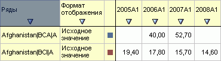
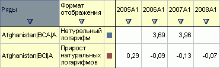
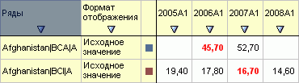
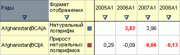

# Синхронизация рядов рабочей книги

Синхронизация рядов рабочей книги
-

# Синхронизация рядов рабочей книги

Если рабочие книги базы данных временных рядов зарегистрированы в одном
 контексте, то между ними будет производиться синхронизация данных. При
 изменении значений ряда одной рабочей книги соответствующие данные будут
 обновлены во всех рядах с теми же значениями обязательных атрибутов.

Для работы с контекстом используется интерфейс [ILanerContext](../Interface/ILanerContext/ILanerContext.htm).
 Приведем пример помещения в контекст двух рабочих книг одной базы данных
 временных рядов. Для этого вам потребуется форма и следующие компоненты:

	- кнопка (идентификатор «Button1»);

	- два компонента UiErAnalyzer (наименования «UiErAnalyzer1»
	 и «UiErAnalyzer2»);

	- два компонента LanerBox (наименования «LanerBox1» и «LanerBox2»).

Компонент «UiErAnalyzer1» является источником данных для «LanerBox1»,
 а «UiErAnalyzer2» для «LanerBox2». В компоненты UiErAnalyzer должны быть
 загружены рабочие книги, созданные на основе одной базы данных временных
 рядов.

Приведенная ниже процедура, должна быть назначена обработчиком события
 OnClick для кнопки «Button1»:

	Sub Button1OnClick(Sender: Object; Args: IMouseEventArgs);

	Var

	    Context: ILanerContext;

	    Laner: ILaner;

	Begin

	    Context := New LanerContext.Create;

	// Регистрируем 1-ю рабочую книгу

	    Laner := UiErAnalyzer1.ErAnalyzer.Laner;

	    Context.Register(Laner);

	// Регистрируем 2-ю рабочую книгу

	    Laner := UiErAnalyzer2.ErAnalyzer.Laner;

	    Context.Register(Laner);

	End Sub Button1OnClick;

После нажатия кнопки «Button1» рабочие книги будут зарегистрированы
 в одном контексте.

## Результат

Ряды в первой рабочей книге:

Ряды во второй рабочей книге:

Изменяем значения рядов в первой рабочей книге:

Данные рядов во второй рабочей книге будут синхронизированы с данными
 рядов в первой рабочей книге:

См. также:

[Примеры](Laner_Samples.htm)
 | [ILanerContext](../Interface/ILanerContext/ILanerContext.htm)

		Справочная
		 система на версию 10.9
		 от 18/08/2025,
		 © ООО «ФОРСАЙТ»,
