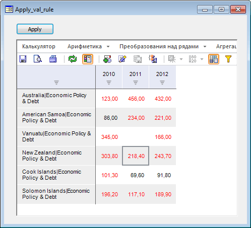

# Настройка и применение валидации

Настройка и применение валидации
-

# Настройка и применение правила валидации

Для выполнения примера предполагается наличие в репозитории:

	- базы данных временных рядов с идентификатором «TSDB»;

	- правила валидации с идентификатором «NEWVALRULE», созданного
	 в базе данных временных рядов «TSDB» (см. «[Создание
	 правила валидации](Apply_validation_rule.htm)»);

	- рабочей книги с идентификатором «OBJ123», построенной на базе
	 данных временных рядов с идентификатором «TSDB». К данным этой рабочей
	 книги будет применяться правило валидации.

Подключите ссылки на следующие системные сборки:

	- Ms;

	- Metabase;

	- Cubes;

	- Dimensions.

## Пример

Создайте форму и добавьте на нее следующие компоненты:

	- UiErAnalyzer c идентификатором «UiErAnalyzer1». В свойстве Object
	 компонента укажите рабочую книгу с идентификатором «OBJ123». Если
	 для свойства Active установлено значение False, измените его на True;

	- LanerBox c идентификатором «LanerBox1». В свойстве Object компонента
	 укажите объект «UiErAnalyzer1»;

	- Button c идентификатором «Button1». Ниже приведена функция,
	 которая будет выполняться при нажатии на кнопку:

			Sub Button1OnClick(Sender: Object; Args: IMouseEventArgs);

Var

    Mb: IMetabase;

    RubrKey: Integer;

    ValidObj: IMetabaseObject;

    ValidFilter: IValidationFilter;

    DateSettings: IValidationDateSettings;

    FilterSett: IValidationFilterSettings;

    Level: IValidationLevel;

    ComparisonValue: IValidationComparisonValue;

    ValidExecSett: IValidationExecuteSettings;

    Analyzer: IEaxAnalyzer;

    ValidExecRun: IValidationExecRun;

    DiagRep: IDiagnosticReport;

Begin

    Mb := MetabaseClass.Active;

    // Получаем правило валидации

    RubrKey := Mb.GetObjectKeyById("TSDB");

    ValidObj := Mb.ItemByIdNamespace("NEWVALRULE", RubrKey).Edit;

    ValidFilter := ValidObj As IValidationFilter;

    // Задаем начальную и конечную даты расчёта правила

    DateSettings := ValidFilter.StartDateSettings;

    DateSettings.DateOptions := ValidationDateOptions.DependsFromData;

    DateSettings := ValidFilter.EndDateSettings;

    DateSettings.DateOptions := ValidationDateOptions.DependsFromData;

    // Задаем уровень календаря для расчёта правила

    ValidFilter.Level := DimCalendarLevel.Year;

    // Задаем пороговое значение для исключений правила

    ValidFilter.ExceptionsLimit := 500000;

    // Задаем параметры расчёта правила

    FilterSett := ValidFilter.Settings;

    // Задаем тип правила

    ValidFilter.Kind := ValidationDetailsKind.Level;

    Level := ValidFilter.Details As IValidationLevel;

    // Задаем условия правила

    ComparisonValue := Level.ComparisonValue;

    ComparisonValue.ComparisonOperator := ValidationComparisonOperator.More;

    ComparisonValue.Percentage := False;

    ComparisonValue.Value1 := 100;

    // Сохраняем изменения в правиле

    ValidObj.Save;

    // Выполняем правило на загруженной рабочей книге

    ValidExecSett := New ValidationExecuteSettings.Create;

    Analyzer := UiErAnalyzer1.ErAnalyzer;

    ValidExecSett.Laner := Analyzer.Laner;

    ValidExecRun := ValidFilter.Execute(ValidExecSett);

    DiagRep := New DiagnosticReport.Create;

    DiagRep.Run := ValidExecRun;

    DiagRep.EaxAnalyzer := Analyzer;

End Sub Button1OnClick;

После выполнения примера при нажатии на кнопку в таблице красным цветом
 будут выделены значения больше 100:

См. также:

[Примеры](Laner_Samples.htm)
 | [Создание правила валидации](Apply_validation_rule.htm)

		Справочная
		 система на версию 10.9
		 от 18/08/2025,
		 © ООО «ФОРСАЙТ»,
