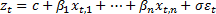
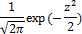
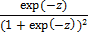
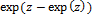
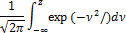
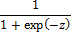
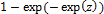
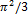
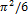
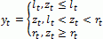

# Линейная регрессия с урезанными и цензурированными данными

Линейная регрессия с урезанными и цензурированными данными
-

# Линейная регрессия с урезанными и цензурированными данными

Линейная регрессия с цензурированными данными - это регрессионная модель,
 в которой зависимая переменная является цензурированной, т.е. преобразовывается,
 если она меньше (или больше) некоторой границы.

В отличие от модели с цензурированными данными, в модели с урезанными
 данными наблюдение целиком исключается, если отклик меньше (или больше)
 некоторой границы.

Пусть временной ряд задан моделью линейной регрессии:

Ошибки εt
 являются последовательностью независимых одинаково распределенных случайных
 величин. Ошибки могут иметь нормальное, логистическое распределение вероятностей
 или распределение вероятностей экстремума первого типа (распределение
 Гумбеля). Основные характеристики этих распределений приведены в таблице:

		 Характеристика\

		Распределение
		 Нормальное
		 Логистическое
		 Гумбеля

		 Плотность
		 
		 
		 

		 Функция распределения
		 
		 
		 

		 Математическое ожидание
		 0
		 0
		 -0.57721566…

		 Дисперсия
		 1
		 
		 

Цензурированная регрессия определяется следующим образом:

Урезанная регрессия определяется следующим образом: yt = zt
 наблюдается только, если lt < zt < rt.

При оценке урезанной/цензурированной регрессии необходимо по наблюдениям
 y1,…,yT
 и l1,…,lT,
 r1,…,rt
 оценить параметры β1,…+βn,σ.

См. также:

[Библиотека методов и моделей](../uimodelling_lib_common.htm)
 | [Линейная
 регрессия](Line_Regression.htm) | [ISmCensoredTruncatedRegression](StatLib.chm::/Interface/ISmCensoredTruncatedRegression/ISmCensoredTruncatedRegression.htm)

		Справочная
		 система на версию 10.9
		 от 18/08/2025,
		 © ООО «ФОРСАЙТ»,
