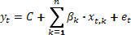
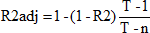
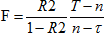

# Множественная линейная регрессия

Множественная линейная регрессия
-

# Множественная линейная регрессия

В общем случае модель имеет вид:

t = 1 … T

Где:

	- T.
	 Число наблюдений;

	- βk.
	 k =1 … n. Оцениваемые коэффициенты при
	 объясняющих переменных;

	- xk.
	 k =1 … n. Объясняющие переменные;

	- et.
	 Остатки;

	- yt.
	 Объясняемая переменная.

В матричной форме модель может быть записана как: Y = Xβ + C + ε.

Если константа C задана (нулевое
 или ненулевое значение), то можно преобразовать модель посредством замены
 Y → Y + C к классическому виду: Y =Xβ + ε.

Если константу требуется оценить, то вводя дополнительную искусственную
 переменную со значением «1» во всех наблюдениях и, соответственно, формируя
 расширенную матрицу X
 посредством добавления к матрице X
 единичного столбца, также сводим модель к классическому виду: Y =Xβ + ε.

При этом подразумеваем замену n → n + 1. Для оценивания
 коэффициентов β или β = (β, C) используем [МНК](UiModelling_LinearRegr_LSM.htm),
 либо метод сингулярного разложения.

При этом, особо рассматривается случай мультиколлинеарности, когда матрица
 X'X либо, соответственно, X'X
 близка к вырожденной (абсолютная величина определителя мала). В этих случаях
 оценка коэффициентов неоднозначна вследствие линейной зависимости столбцов
 матрицы X или X. Для получения однозначной оценки
 исключаем столбцы из матрицы X
 до тех пор, пока она (или соответствующая матрица X)
 не станет иметь максимальный ранг.

Дополнительные характеристики модели. [Коэффициент
 детерминации](../05_Statistics/UiModellind_DetermCoeff_R2.htm):

Где:

	- y* = τYi;

	- e = Y - Ŷ;

	- ;

	- i. Единичный столбец;

	- 

	- τ = 1 в случае автооценивания константы, τ = 0
	 в случае ручного оценивания.

[Исправленный
 коэффициент детерминации](../05_Statistics/UiModellind_DetermCoeff_AdjR2.htm) (не определено при T = n):

Значение [статистики
 Фишера](../05_Statistics/UiModelling_Fisher.htm):

См. также:

[Библиотека методов и моделей](../uimodelling_lib_common.htm)

		Справочная
		 система на версию 10.9
		 от 18/08/2025,
		 © ООО «ФОРСАЙТ»,
