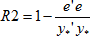
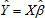
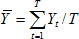
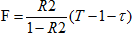

# Парная линейная регрессия

Парная линейная регрессия
-

# Парная линейная регрессия

В общем случае модель имеет вид:

yt =
 βxt + C + et

t = 1 … T

Или в векторной форме

y = βx + e

Где:

	- T.
	 Число наблюдений;

	- β. Оцениваемый коэффициент
	 при объясняющей переменной;

	- xt.
	 Наблюдения объясняющей переменной;

	- et.
	 Остатки;

	- yt.
	 Объясняемая переменная.

Если константа C задана (нулевое
 или ненулевое значение), то можно преобразовать модель посредством замены
 Y → Y + C к классическому виду: Y =Xβ + ε.

Если константу требуется оценить, то вводя дополнительную искусственную
 переменную со значением «1» во всех наблюдениях и, соответственно, формируя
 расширенную матрицу X
 посредством добавления к матрице X
 единичного столбца, также сводим модель к классическому виду: Y =Xβ + ε.

При этом подразумеваем замену n → n + 1. Для оценивания
 коэффициентов β или β = (β, C) используем [МНК](UiModelling_LinearRegr_LSM.htm).

Дополнительные характеристики модели. [Коэффициент
 детерминации](../05_Statistics/UiModellind_DetermCoeff_R2.htm):

Где:

	- y* = τYi;

	- e = Y - Ŷ;

	- ;

	- i. Единичный столбец;

	- ;

	- τ = 1 в случае автооценивания константы, τ = 0
	 в случае ручного оценивания.

Значение [статистики
 Фишера](../05_Statistics/UiModelling_Fisher.htm):

См. также:

[Библиотека методов и моделей](../uimodelling_lib_common.htm)

		Справочная
		 система на версию 10.9
		 от 18/08/2025,
		 © ООО «ФОРСАЙТ»,
