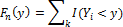
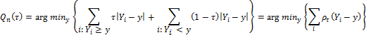
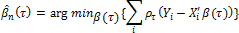
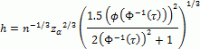
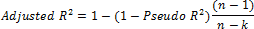

# Квантильная регрессия

Квантильная регрессия
-

# Квантильная регрессия

Квантильная регрессия - процедура оценки параметров линейной зависимости
 между объясняющими переменными и заданным уровнем квантили объясняемой
 переменной. В отличие от обычного [метода
 наименьших квадратов](UiModelling_LinearRegr_LSM.htm), квантильная регрессия является непараметрическим
 методом. Это позволяет получить больше информации: параметры регрессии
 для любых квантилей распределения зависимой переменной. Кроме того, такая
 модель значительно менее чувствительна к выбросам в данных и к нарушениям
 предположений о характере распределений.

Пусть Y - случайная переменная
 с функцией распределения вероятностей F(y) = Prob(Y ≤ y).
 Тогда квантилем уровня τ, где 0 < τ <1, будет являться
 наименьшая величина Y, удовлетворяющая
 условию F(y) > τ:

Q(τ) = inf{y:F(y) ≥ τ}

Учитывая набор n наблюдений
 по переменной Y, традиционная
 эмпирическая функция распределения определяется по формуле:

Где I(Yi < y) индикатор функции, который дает
 значение 1, если аргумент принимает значение ПРАВДА и 0, если ЛОЖЬ.

Соответствующий эмпирический квантиль определяется по следующей формуле:

Qn(τ) = inf{y:Fn(y) ≥ τ}

Эквивалентна запись в виде задачи оптимизации:

Где ρτ(u) = u(τ - I(u < 0))
 - функция, по-разному взвешивающая положительные и отрицательные значения
 Yi - y.

Квантильная регрессия расширяет данную задачу, позволяя учитывать регрессоры.

Пусть условные квантили заданных значений переменной Y
 линейно зависят от вектора объясняющих переменных Х:

Q(τ|Xi,β(τ)) = X̕i,β(τ)

Где β(τ)
 - это вектор коэффициентов, соответствующих квантилю τ.
 Тогда задача безусловной минимизации выглядит следующим образом:

Данная задача решается с помощью модифицированного симплекс-метода.

## Статистики квантильной регрессии

### Разреженность наблюдений

Один из вариантов оценки разреженности наблюдений:

s(τ) = X*'(β(τ + h) - β(τ - h))/(2h),

где:

	- τ. Квантиль;

	- X*. Вектор значений объясняющих переменных;

	- h.
	 Окрестность, для которой рассчитывается разряженность наблюдений.

В простейшем случае: X* = X̅ - вектор
 средних значений объясняющих переменных.

h вычисляется по формуле:

,

где zα = Φ-1(1 - α/2), α – уровень
 значимости.

### Ковариационная матрица

Для точного расчета матрицы необходимо значение разряженности наблюдений.
 При приближенной оценке оно не требуется.

Для расчёта обычной ковариации с помощью гипотезы НОРСВ (независимых
 одинаково распределённых случайных величин, англ. Ordinary(IID)
 covariance) используется формула:

cov(β) = s2(X'X)-1,

где s2 = τ(1 - τ)s(τ)2
 - дисперсия ошибок.

### Значение ограниченной целевой функции

Для вычисления необходимо рассчитать квантильную регрессию вида y = c,
 где c - константа. Минимальное
 значение целевой функции будет необходимым значением.

### Значение целевой функции заданной модели

Для вычисления необходимо рассчитать квантильную регрессию, описанную
 выше.

### Квантиль объясняемой переменной

Для вычисления необходимо рассчитать квантильную регрессию вида y = c,
 где c - константа. Оцененный
 коэффициент модели будет необходимым значением.

### Псевдокоэффициент детерминации

Рассчитывается по формуле:

Pseudo R2 = 1 - objective/restr.objective,

где:

	- objective.
	 Значение целевой функции заданной модели;

	- restr.objective.
	 Значение ограниченной целевой функции.

### Скорректированный (adjusted) коэффициент детерминации

Рассчитывается по формуле:

,

где:

	- n.
	 Количество наблюдений;

	- k.
	 Количество коэффициентов модели, включая константу.

См. также:

[Библиотека методов и моделей](../uimodelling_lib_common.htm)
 | [ISmQuantileRegression](StatLib.chm::/Interface/ISmQuantileRegression/ISmQuantileRegression.htm)

		Справочная
		 система на версию 10.9
		 от 18/08/2025,
		 © ООО «ФОРСАЙТ»,
