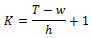

# Скользящая регрессия

Скользящая регрессия
-

# Скользящая регрессия

Скользящая регрессия (от англ. rolling regression) - процедура
 оценки параметров регрессии на последовательно сдвигаемом во времени выборочном
 интервале постоянной ширины. Регрессия позволяет построить траектории
 оценок коэффициентов вместе с их доверительными границами и проверить
 гипотезу о постоянстве коэффициентов регрессионного уравнения во времени.

Выборочный интервал постоянной ширины будем называть «роллом». Пусть
 один «ролл» содержит w наблюдений,
 тогда модель k-ой скользящей
 регрессии с шагом h выглядит
 следующим образом:

yk=Xk βk+ek

Где:

	- yk = (y(k-1)h+1, …, y(k-1)h+w). Вектор зависимых переменных размерности
	 (w x 1);

	- Xk = (X(k-1)h+1, …, X(k-1)h+w).
	 Матрица независимых переменных размерности (w x m);

	- βk. Вектор оценок размерности (m x 1);

	- ek.
	 Вектор случайных ошибок размерности (w x 1).

Всего таких «роллов»
 будет

Где T
 - общее число наблюдений.

Для полученных βk
 можно:

	- вычислить средние
	 значения коэффициентов для каждого фактора и использовать их в качестве
	 оценок коэффициентов общей модели;

	- вычислить дисперсии
	 значений коэффициентов для каждого фактора для проверки гипотезы о
	 постоянстве коэффициентов регрессионного уравнения;

	- построить графики
	 изменения коэффициентов и визуально оценить динамику их развития.

См. также:

[Библиотека методов и моделей](../uimodelling_lib_common.htm)
 | [ISmRollingRegression](StatLib.chm::/Interface/ISmRollingRegression/ISmRollingRegression.htm)

		Справочная
		 система на версию 10.9
		 от 18/08/2025,
		 © ООО «ФОРСАЙТ»,
