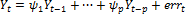
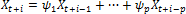

# Авторегрессия

Авторегрессия
-

# Авторегрессия

Авторегрессионная модель предназначена для описания стационарных временных
 рядов. В этой модели значение исследуемого процесса выражается через конечную
 линейную совокупность предыдущих значений процесса и некоторого возмущения.

Таким образом, под процессом авторегрессии порядка p
 понимают процесс Xt, удовлетворяющий для некоторой константы
 µ соотношению:

Где:

	- Yt = Xt - µ;

	- errt.
	 Возмущение с нулевым математическим ожиданием и дисперсией δ2, значения
	 которого в различные моменты времени независимы и одинаково распределены
	 (иначе, «белый шум»).

В этой модели p+2 неизвестных
 параметра µ, ψ1, ψ2, …, ψp, δ2, которые
 должны быть оценены по имеющимся данным об изучаемом процессе.

После оценки неизвестных параметров можно приступить к прогнозированию
 динамики исследуемого ряда. В данной системе прогнозирование осуществляется
 рекурсивно непосредственно по разностному уравнению:

последовательно полагая i=1,2,…,T и заменяя Xj для t < t+i их прогнозами на предыдущих шагах
 (где T – период упреждения).

Приведенное уравнение может описывать и нестационарные процессы.

## Стационарные и нестационарные процессы

Процесс Xt стационарен,
 если все корни полинома ψ(z) = zp + ψ1zp-1 + … + ψp
 лежат внутри единичного круга |z|<1.
 Тогда µ – среднее значение, вокруг
 которого процесс варьирует.

В противном случае Xt нестационарен
 и µ не имеет особого смысла,
 кроме как некой точки отсчета уровня процесса.

## Применение авторегрессии для моделирования остатков

При слабых дополнительных предположениях стационарный процесс удовлетворяет
 уравнению авторегрессии бесконечного порядка с достаточно быстро убывающими
 коэффициентами. В частности поэтому авторегрессионная модель достаточно
 высокого порядка может хорошо аппроксимировать почти любой стационарный
 процесс.

В связи с этим модель авторегрессии часто применяется для моделирования
 остатков в той или иной параметрической модели, например, регрессионной
 модели или модели тренда.

Для процесса авторегрессии порядка p
 теоретические значения частной автокорреляционной функции для лагов, больших
 p, равны нулю. На основании этого
 свойства можно выбирать порядок модели авторегрессии для описания выборочных
 данных. Для решения практических задач, как правило, достаточно p ≤ 2.

См. также:

[Библиотека методов и моделей](../uimodelling_lib_common.htm)

		Справочная
		 система на версию 10.9
		 от 18/08/2025,
		 © ООО «ФОРСАЙТ»,
