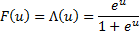
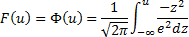

# Бинарная регрессия

Бинарная регрессия
-

# Бинарная регрессия

Данный метод осуществляет оценку коэффициентов регрессионной модели,
 в которой зависимая переменная принимает два значения: «0» или «1». В
 рамках метода предусмотрены следующие модели:

	- Logit-модель предполагает,
	 что случайные ошибки модели распределены по закону:

	- Probit-модель предполагает,
	 что случайные ошибки модели распределены по закону:

	- Gompit-модель предполагает,
	 что случайные ошибки модели распределены по закону:

Рассматривается линейная регрессионная модель:

yt = 1 - F(-x'tβ) + εt

t = 1, …, n

Где:

	- t.
	 Номер наблюдения;

	- β = (β1, β2, …, βk)'.
	 Набор неизвестных параметров (коэффициентов);

	- εt.
	 Случайная ошибка E(εt) = 0;

	- Yt.
	 Принимает значения «0» или «1».

См. также:

[Библиотека методов и моделей](../uimodelling_lib_common.htm)
 | Контейнер моделирования: [Модель
 бинарного выбора (оценка методом максимального правдоподобия)](UiModelling.chm::/2_Container_of_Modeling/2_3_Work_object/2_3_2_Model/Specification/Binary_regression/UiModelling_Spec_Binary_regression.htm) |
 [ISmBinaryModel](StatLib.chm::/Interface/ISmBinaryModel/ISmBinaryModel.htm)

		Справочная
		 система на версию 10.9
		 от 18/08/2025,
		 © ООО «ФОРСАЙТ»,
