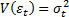
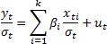
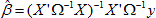

# Метод наименьших квадратов

Метод наименьших квадратов
-

# Метод наименьших квадратов

Метод наименьших квадратов (МНК) — один из методов регрессионного анализа
 для оценки неизвестных величин по результатам измерений, содержащим случайные
 ошибки. Данный метод применяется также для приближённого представления
 заданной функции другими (более простыми) функциями и часто оказывается
 полезным при обработке наблюдений.

Когда искомая величина может быть измерена непосредственно, как, например,
 длина отрезка или угол, то, для увеличения точности измерение производится
 много раз, и за окончательный результат берут арифметическое среднее из
 всех отдельных измерений. Это правило арифметической середины основывается
 на соображениях теории вероятностей; легко показать, что сумма квадратов
 уклонений отдельных измерений от арифметической середины будет меньше,
 чем сумма квадратов уклонений отдельных измерений от какой бы то ни было
 другой величины. Само правило арифметической середины представляет, следовательно,
 простейший случай метода наименьших квадратов.

При применении МНК используется подстановка в начальные уравнения неизвестных
 величин. При этом в правых частях уравнений получаются если не нули, то
 небольшие величины, сумма квадратов которых оказывается меньшей, чем сумма
 квадратов подобных же остатков после подстановки каких бы то ни было других
 значений неизвестных. Помимо этого, решение уравнений по способу наименьших
 квадратов даёт возможность выводить вероятные ошибки неизвестных, то есть
 даёт величины, по которым судят о степени точности выводов.

# Двухшаговый МНК. Системы одновременных уравнений

Система одновременных уравнений — это система уравнений, содержащая
 взаимозависимые переменные, которые включены в одно из уравнений модели
 в качестве результативного признака, а в другие уравнения - в качестве
 факторного признака. Коэффициенты системы одновременных уравнений нельзя
 определить обычным МНК, так как правая часть системы одновременных уравнений
 содержит эндогенные переменные. Наиболее распространенным методом для
 расчета является двухшаговый метод наименьших квадратов (ДМНК).

ДМНК состоит в следующем:

	- составляют приведенную форму модели и определяют численные значения
	 ее параметров обычным МНК;

	- выявляют эндогенные переменные, находящиеся в правой части структурного
	 уравнения, параметры которого определяют ДМНК, и находят их расчетные
	 значения по соответствующим уравнениям приведенной формы модели;

	- обычным МНК определяют параметры структурного уравнения, используя
	 в качестве исходных данных фактические значения предопределенных переменных
	 и расчетные значения эндогенных переменных, стоящих в правой части
	 данного структурного уравнения.

ДМНК производит оценку коэффициентов заданного регрессионного уравнения:
 y = Y·a + X·b + u.

Где:

	- y.
	 Зависимая переменная уравнения;

	- Y.
	 Матрица n*g
	 наблюдений над другими значениями эндогенных переменных, входящих
	 в уравнение;

	- X.
	 Матрица n*k
	 наблюдений над предопределёнными переменными, входящими в уравнение;

	- a.
	 Вектор g*1 структурных коэффициентов,
	 относящихся к переменным из матрицы Y;

	- b.
	 Вектор k*1 коэффициентов,
	 относящихся к переменным из матрицы X;

	- u.
	 Вектор n*1 случайных возмущений.

# Взвешенный МНК

Метод применяется для оценивания коэффициентов модели y =
 Xβ + e,
 минимизирующей сумму квадратов отклонений e'e.
 Оценивание выполняется по формуле β = (X'X)-1X'Y.

При этом особо рассматривается случай мультиколлинеарности, когда матрица
 X'X близка к вырожденной (абсолютная
 величина определителя мала). В этих случаях оценка коэффициентов неоднозначна
 вследствие линейной зависимости столбцов матрицы X.
 Для получения однозначной оценки исключаем столбцы из матрицы X
 до тех пор, пока она не станет иметь максимальный ранг.

Взвешивание применяется для оценивания коэффициентов модели Y =Xβ + ε в предположении
 гетероскедастичности остатков .

Случай сводится к стандартной модели [множественной
 линейной регрессии](Lib_MultiRegress.htm) с гомоскедастичными остатками несложным преобразованием:

Оценивание полученной модели выполняется стандартным МНК.

# Доступный обобщенный МНК

В случае линейной регрессионной модели Y =Xβ + ε в предположении
 распределения остатков ε по закону N(0, σ2Ω) с
 заданной матрицей ковариаций Ω, оценка доступного обобщенного метода наименьших
 квадратов реализуется формулой:

При наличии в модели константы, подлежащей автоматическому оцениванию,
 следует дополнить матрицу X единичным
 столбцом.

См. также:

[Линейная регрессия](Line_Regression.htm) |
 Контейнер моделирования: модель «[Линейная
 регрессия (оценка МНК)](UiModelling.chm::/2_Container_of_Modeling/2_3_Work_object/2_3_2_Model/Specification/8_Linear_regression/uimodelling_model_specification_linaer_reg.htm)» | Анализ временных рядов: [Линейная
 регрессия](UiDw.chm::/Workbook/CalculatedSeries/Regression/UiDw_cs_LinearRegression.htm) | [IModelling.Ols](KeMs.chm::/Interface/IModelling/IModelling.Ols.htm)
 | [ISmSimultaneousSystem](StatLib.chm::/Interface/ISmSimultaneousSystem/ISmSimultaneousSystem.htm)

		Справочная
		 система на версию 10.9
		 от 18/08/2025,
		 © ООО «ФОРСАЙТ»,
