# Регрессия на панельных данных

Регрессия на панельных данных
-

# Регрессия на панельных данных

Имеется множество объектов (i=1,…,n), которые наблюдаются в моменты
 времени t=1,…,T.
 Каждый рассматриваемый объект характеризуется k переменными (признаками):

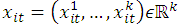

Для большинства баз панельных данных характерно, что они содержат наблюдения
 о большом количестве объектов за относительно короткий промежуток времени.

Обозначим:

	- 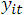– зависимая переменная
	 для экономической единицы i
	 в момент времени t;

	- 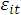 – соответствующая
	 ошибка;

Введем также «объединенные» наблюдения и ошибки:

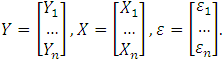

## Объединенная модель регрессии

Это обычная линейная модель регрессии:

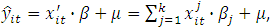

в матричной форме:

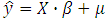

где β – неизвестный вектор
 размера k×1.

Считается, что зависимая переменная линейно зависит от всех переменных
 в тот же момент времени.

Для настройки параметров можно использовать метод наименьших квадратов:

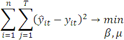

## Модель панельных данных с эффектами

Модель опирается на структуру панельных данных, что позволяет учитывать
 неизмеримые индивидуальные различия объектов. Эти отличия называются эффектами.

### Модель панельных данных с фиксированными эффектами

В данной модели эффекты интерпретируются как мешающий параметр, и оценивание
 направлено на то, чтобы их исключить.

Модель описывается уравнением:

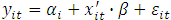

Величина 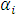 выражает индивидуальный
 эффект объекта i, не зависящий от времени t, при этом регрессоры 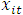 не содержат константу.

### Модель панельных данных со случайными эффектами

В данной модели предполагается, что индивидуальные отличия носят случайный
 характер.

Модель описывается уравнением:

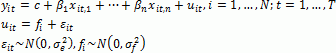

См. также:

Контейнер моделирования: «[Модель
 на панельных данных](UiModelling.chm::/2_Container_of_Modeling/2_3_Work_object/2_3_2_Model/PooledModel/UiModelling_PooledModel_Main.htm)» | [ISmPooledModel](StatLib.chm::/Interface/ISmPooledModel/ISmPooledModel.htm)

		Справочная
		 система на версию 10.9
		 от 18/08/2025,
		 © ООО «ФОРСАЙТ»,
