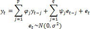
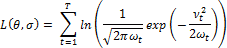

# Оценка коэффициентов с помощью метода максимального правдоподобия

Оценка коэффициентов с помощью метода максимального правдоподобия
-

# Оценка коэффициентов с помощью метода максимального правдоподобия

Рассмотрим оценку коэффициентов ARMA с помощью [метода максимального правдоподобия](../05_Statistics/Distribution/MaximumLikelihood.htm). Пусть задана модель ARMA:

Обозначим θ = (φ, ψ).

Основная цель алгоритма - максимизация логарифмической функции максимального правдоподобия, которая для модели ARMA имеет вид:

,

где: 

Для оценки νt и ωt применяется фильтр Калмана - итерационный алгоритм, позволяющий удалить ошибки наблюдений. После сглаживания νt и ωt решение данной задачи даст оценку коэффициентов модели ARMA.

См. также:

[Библиотека методов и моделей](../uimodelling_lib_common.htm) | [ARIMA](UiModelling_ARIMA.htm) | [Оценка коэффициентов модели ARIMA](Lib_ARIMA_Coef.htm) | [Оценка методом максимального правдоподобия](../05_Statistics/Distribution/MaximumLikelihood.htm)

		Справочная
		 система на версию 10.9
		 от 18/08/2025,
		 © ООО «ФОРСАЙТ»,
