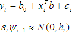
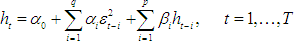
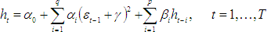
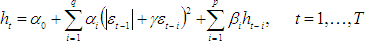
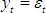
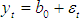
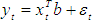
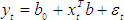

# GARCH-модель

GARCH-модель
-

# GARCH-модель

Авторегрессия условной гетероскедастичности (ARCH) - применяемая в эконометрике
 модель для отыскания зависимости дисперсии текущей ошибки от квадратов
 ошибок модели для предшествующих наблюдений.

Если для описания дисперсии ошибок применяются авторегрессионные члены,
 модель называется обобщенной авторегрессией условной гетероскедастичности
 (GARCH).

Оцениваются параметры GARCH(p, q) модели:

Где:

	- T.
	 Число наблюдений;

	- yt.
	 Эндогенная переменная;

	- xt.
	 Экзогенная переменная;

	- b0. Среднее;

	- b.
	 Вектор регрессионных коэффициентов;

	- εt.
	 Остатки;

	- ht.
	 Условная дисперсия остатков;

	- p.
	 Порядок авторегрессии;

	- q.
	 Порядок скользящего среднего.

Для расчета условной дисперсии ht можно использовать
 одно из уравнений:

	- стандартное:

	- тип 1:

	- тип 2:

Где γ - параметр асимметрии.

Возможны следующие варианты модели:

	- без регрессоров и без константы:

	- без регрессоров, с константой:

	- с регрессорами и без константы:

	- с регрессорами и с константой:

См. также:

[ISmGARCH](StatLib.chm::/Interface/ISmGARCH/ISmGARCH.htm) |
 [Библиотека
 методов и моделей](../uimodelling_lib_common.htm)

		Справочная
		 система на версию 10.9
		 от 18/08/2025,
		 © ООО «ФОРСАЙТ»,
