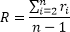
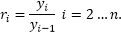

# Геометрическая экстраполяция

Геометрическая экстраполяция
-

# Геометрическая экстраполяция

Экстраполяция - это особый тип аппроксимации (приближения), при котором
 функция аппроксимируется не между заданными значениями, а вне заданного
 интервала.

Пусть дан исходный ряд Y = {y1, y2, …, yn},
 тогда экстраполирующий коэффициент для геометрической экстраполяции рассчитывается
 следующим образом:

,

где:

Следовательно, используя динамический подход, экстраполированный ряд
 рассчитывается по следующей формуле:

См. также:

[Библиотека методов и моделей](../uimodelling_lib_common.htm)
 | [ISmGeometricExtrapolation](StatLib.chm::/Interface/ISmGeometricExtrapolation/ISmGeometricExtrapolation.htm)

		Справочная
		 система на версию 10.9
		 от 18/08/2025,
		 © ООО «ФОРСАЙТ»,
