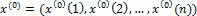
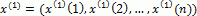
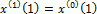
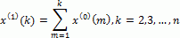
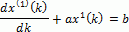
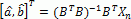
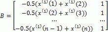
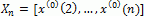
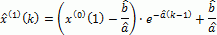
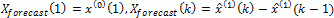

# Модель GM(1,1) (Грей-метод)

Модель GM(1,1) (Грей-метод)
-

# Модель GM(1,1) (Грей-метод)

Грей-метод подходит для прогнозирования
 поведения нелинейных временных рядов. Данный метод относится к нестатистическим
 методам прогнозирования и особенно эффективен в условиях недостаточного
 числа наблюдений.

Обозначим наблюдаемый временной ряд как , где n - количество наблюдений.

Определим ряд x(1) следующим образом: .

Где:

Модель GM(1,1) определяется дифференциальным уравнением первого порядка:

Получить решение можно с помощью метода наименьших квадратов:

,

где:

Дискретное решение дифференциального уравнения:

Тогда предсказанный ряд рассчитывается по формуле:

, где k = 2,3,…,n.

См. также:

[Библиотека методов и моделей](../uimodelling_lib_common.htm)
 | Контейнер моделирования: спецификация модели «[Грей-метод](uimodelling.chm::/2_Container_of_Modeling/2_3_Work_object/2_3_2_Model/Specification/UiModelling_Specification_GrayForecast.htm)» |
 Анализ временных рядов: прогнозирование [Грей-методом](uidw.chm::/Workbook/CalculatedSeries/Forecast/UiDw_cs_GreyForecast.htm) |
 [IModelling.Greyforecast](kems.chm::/Interface/IModelling/IModelling.Greyforecast.htm) |
 [ISmGreyForecast](StatLib.chm::/Interface/ISmGreyForecast/ISmGreyForecast.htm)

		Справочная
		 система на версию 10.9
		 от 18/08/2025,
		 © ООО «ФОРСАЙТ»,
