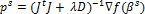
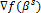

# Метод Левенберга-Марквардта

Метод Левенберга-Марквардта
-

# Метод Левенберга-Марквардта

Метод Левенберга-Марквардта, как и [квазиньютоновский метод](Quasi_Newton.htm), является модификацией классического метода Гаусса-Ньютона для минимизации суммы квадратов функций.

В методе Левенберга-Марквардта при поиске направления для очередного приближения используется корректирующий множитель. Направление находится по формуле:

,

где D - диагональная матрица, у которой главная диагональ совпадает с главной диагональю матрицы JtJ.

Корректирующий множитель λ (множитель Марквардта) пересчитывается на каждой итерации метода, причем он уменьшается при сильном уменьшении целевой функции (направление становится ближе к направлению Гаусса-Ньютона) и увеличивается при недостаточном уменьшении либо невозможности уменьшения целевой функции (направление становится ближе к ).

Пересчет длины шага αs методом линейного поиска происходит не на каждой итерации, а лишь при невозможности уменьшить целевую функцию. При этом множитель Марквардта также меняется (в сторону увеличения). Если пять последовательных итераций не привели к уменьшению целевой функции, то алгоритм заканчивает работу. Остальные условия останова алгоритма Левенберга-Марквардта совпадают с условиями останова [квазиньютоновского алгоритма](Quasi_Newton.htm).

См. также:

[Библиотека методов и моделей](../uimodelling_lib_common.htm) | [ARIMA](UiModelling_ARIMA.htm) | [Оценка коэффициентов модели ARIMA](Lib_ARIMA_Coef.htm)

		Справочная
		 система на версию 10.9
		 от 18/08/2025,
		 © ООО «ФОРСАЙТ»,
