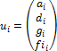
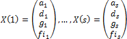
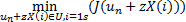
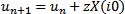

# Метод наилучшей пробы

Метод наилучшей пробы
-

# Метод наилучшей пробы

Метод наилучшей пробы применяется для автоподбора параметров экспоненциального
 сглаживания.

Обозначим i-е приближение:

,

где:

	- ai.
	 Параметр α;

	- di.
	 Параметр δ;

	- gi. Параметр
	 γ;

	- fii. Параметр
	 ϕ.

n+1-ое приближение un+1
 при наличии n-ого приближения
 un
 ищется следующим образом:

	- Берем какие-либо S
	 реализаций случайных векторов:

	- Находим индекс i0 по
	 критерию:

Где J
 – критерий оптимальности предсказаний на один шаг вперед в задаче экспоненциального
 сглаживания;

	- Находим n+1 приближение:

	- Переходим на первый шаг.

См. также:

[Экспоненциальное сглаживание](UiModelling_ExpSmooth.htm)
 | [Модель
 с сезонными эффектами](UiModelling_ExpSmooth_season.htm) | [Модели роста](UiModelling_ExpSmooth_growthhtm.htm)
 | [IExponentialSmoothingBestTrialMethod](StatLib.chm::/Interface/IExponentialSmoothingBestTrialMethod/IExponentialSmoothingBestTrialMethod.htm)

		Справочная
		 система на версию 10.9
		 от 18/08/2025,
		 © ООО «ФОРСАЙТ»,
