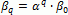
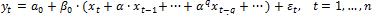
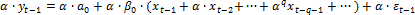
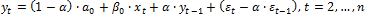

# Модель геометрически распределенных лагов. Метод Койка

Модель геометрически распределенных лагов. Метод Койка
-

# Модель геометрически распределенных лагов. Метод Койка

В распределении Койка предполагается, что в [модели распределенных лагов](UiModelling_Polinimial_Distributed_Lags.htm):

коэффициенты βq при лаговых значениях объясняющей переменной задаются убывающей геометрической прогрессией:

, где α < 1.

Следовательно, модель распределенных лагов имеет вид:

Умножим уравнение, вычисленное для предыдущего периода времени t-1, на коэффициент α:

Вычтем полученное уравнение из исходного. В результате получим:

С помощью данного преобразования уравнение с бесконечным числом лагов преобразуется в авторегрессионное уравнение, для которого требуется оценить лишь три коэффициента.

См. также:

[Библиотека методов и моделей](../uimodelling_lib_common.htm) | [Модели распределенных лагов](UiModelling_Polinimial_Distributed_Lags.htm) | [ISmLinearRegress.GDLTerms](StatLib.chm::/Interface/ISmLinearRegress/ISmLinearRegress.GDLTerms.htm)

		Справочная
		 система на версию 10.9
		 от 18/08/2025,
		 © ООО «ФОРСАЙТ»,
