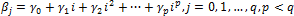
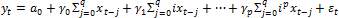
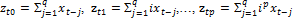
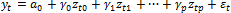

# Модель полиноминально распределенных лагов. Метод Алмона

Модель полиноминально распределенных лагов. Метод Алмона
-

# Модель полиноминально распределенных лагов. Метод Алмона

В основе модели полиномиально распределенных лагов лежит предположение о том, что в [модели распределенных лагов](UiModelling_Polinimial_Distributed_Lags.htm):

наблюдается полиномиальная зависимость βj от номера j, которая может быть выражена в виде:

Используя это предположение, уравнение модели можно записать в виде:

Введем обозначения:

Тогда модель приобретает вид:

Для оценки её параметров можно использовать [стандартный МНК](../01_Regression_models/UiModelling_LinearRegr_LSM.htm).

Для применения метода Алмона необходимо вначале определиться с количеством лагов q. Обычно это количество находится подбором, начиная с «разумного» максимального, постепенно его уменьшая. После определения q необходимо подобрать степень полинома r. Обычно используется следующее правило: степень полинома должна быть, по крайней мере, на единицу больше количества точек экстремума (точек, разделяющих интервалы возрастания и убывания) в зависимости βi = β(t - i). Однако с ростом степени полинома повышается риск наличия неучтенной мультиколлинеарности в силу специфики построения переменных z. Это увеличивает стандартные ошибки коэффициентов γj.

См. также:

[Библиотека методов и моделей](../uimodelling_lib_common.htm) | [Модели распределенных лагов](UiModelling_Polinimial_Distributed_Lags.htm)

		Справочная
		 система на версию 10.9
		 от 18/08/2025,
		 © ООО «ФОРСАЙТ»,
