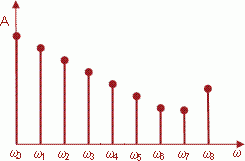

# Спектральный анализ

Спектральный анализ
-

# Спектральный анализ

Спектральный анализ - это разновидность
 обработки данных, связанная с преобразованием их частотного представления
 или спектра. Спектр получается в результате разложения исходной функции,
 зависящей от времени (временной ряд) или пространственных координат, в
 базис некоторой периодической функции. Наиболее часто для спектральной
 обработки используется спектр Фурье, получаемый на основе базиса синуса
 (преобразование Фурье).

Основной смысл преобразования Фурье в том, что исходная непериодическая
 функция произвольной формы, которую невозможно описать аналитически и
 в общем случае трудная для обработки и анализа, представляется в виде
 совокупности синусов или косинусов с различной частотой и амплитудой.
 Иными словами, сложная функция преобразуется в множество более простых.
 Каждая синусоида (или косинусоида) с определенной частотой и амплитудой,
 полученная в результате преобразования Фурье, называется спектральной
 составляющей или гармоникой. Спектральные составляющие образуют спектр
 Фурье.

Визуально спектр Фурье представляется в виде графика, на котором по
 горизонтальной оси откладывается круговая частота, обозначаемая ω, а по
 вертикали – амплитуда спектральных составляющих, обычно обозначаемая A. Тогда каждая спектральная составляющая
 может быть представлена в виде отсчета, положение которого по горизонтали
 соответствует ее частоте, а высота – ее амплитуде. Гармоника с нулевой
 частотой называется постоянной составляющей (во временном представлении
 это прямая линия).

Даже простой визуальный анализ спектра может много сказать о характере
 функции, на основе которой он был получен. Интуитивно понятно, что быстрые
 изменения исходных данных порождают в спектре составляющие с высокой частотой,
 а медленные – с низкой. Поэтому если в нем амплитуда составляющих быстро
 убывает с увеличением частоты, то исходная функция (например, временной
 ряд) является плавной, а если в спектре присутствуют высокочастотные составляющие
 с большой амплитудой, то исходная функция будет содержать резкие колебания.
 Так, для временного ряда это может указывать на большую случайную составляющую,
 неустойчивость описываемых им процессов, наличие шумов в данных.

В основе спектральной обработки лежит манипулирование спектром. Если
 уменьшить (подавить) амплитуду высокочастотных составляющих, а затем на
 основе измененного спектра восстановить исходную функцию, выполнив обратное
 преобразование Фурье, то она станет более гладкой за счет удаления высокочастотной
 компоненты. Для временного ряда, например, это означает убрать информацию
 о ежедневных продажах, которые сильно подвержены случайным факторам, и
 оставить более устойчивые тенденции, например, сезонность. Можно, наоборот,
 подавить составляющие с низкой частотой, что позволит убрать медленные
 изменения, а оставить только быстрые. В случае временного ряда это будет
 означать подавление сезонной компоненты.

Применяя спектр таким образом, можно добиваться желаемого изменения
 исходных данных. Наиболее часто используется сглаживание временных рядов
 путем удаления или уменьшения амплитуды высокочастотных составляющих в
 спектре.

Для манипуляций со спектрами используются фильтры – алгоритмы, способные
 управлять формой спектра, подавлять или усиливать его составляющие. Главным
 свойством любого фильтра является его амплитудно-частотная характеристика,
 от формы которой зависит преобразование спектра. Если фильтр подавляет
 только составляющие с низкой частотой, то он называется фильтр нижних
 частот (ФНЧ), и с его помощью можно сглаживать данные, очищать их от шума
 и аномальных значений, а если только составляющие с высокой частотой,
 то это фильтр высоких частот (ФВЧ). Благодаря ему можно подавлять медленные
 изменения, например, сезонность в рядах данных. Кроме этого, используется
 множество других типов фильтров: фильтры средних частот, заградительные
 фильтры и полосовые фильтры и т.д. Подбирая тип и форму частотной характеристики
 фильтра, можно добиться желаемого преобразования исходных данных путем
 спектральной обработки.

Выполняя частотную фильтрацию данных с целью сглаживания и очистки от
 шума, необходимо правильно указать полосу пропускания ФНЧ. Если ее выбрать
 слишком большой, то степень сглаживания будет недостаточной, а шум будет
 подавлен не полностью. Если она будет слишком узкой, то вместе с шумом
 могут оказаться подавленными и изменения, несущие полезную информацию.
 Если в технических приложениях существуют строгие критерии для определения
 оптимальности характеристик фильтров, то в аналитических технологиях приходится
 использовать в основном экспериментальные методы.

Спектральный анализ является одной из наиболее эффективных и хорошо
 разработанных методов обработки данных. Частотная фильтрация – только
 одно из его многочисленных приложений. Кроме этого, он используется в
 корреляционном и статистическом анализе, синтезе сигналов и функций, построении
 моделей и т.д.

См. также:

[Библиотека методов и моделей](../uimodelling_lib_common.htm)

		Справочная
		 система на версию 10.9
		 от 18/08/2025,
		 © ООО «ФОРСАЙТ»,
