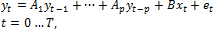
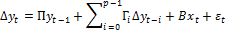
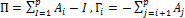
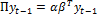
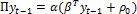
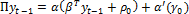
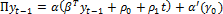
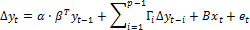

# Векторная модель коррекции ошибок

Векторная модель коррекции ошибок
-

# Векторная модель коррекции ошибок

Рассмотрим модель р-го порядка:

Где:

	- yt.
	 k-мерный вектор нестационарных
	 переменных;

	- xt.
	 d-мерный вектор экзогенных
	 переменных;

	- et.
	 k-мерный вектор случайных
	 составляющих.

Модель можно представить в виде:

Где:

Ключевая теорема Гранжера гласит, что если матрица П имеет неполный
 ранг r<k,
 то существуют kxr
 матрицы α и β, каждая ранга r,
 такие, что П = α · βT,
 ряд βT является
 стационарным, и каждый столбец матрицы β является коинтеграционным
 вектором, r - число коинтеграционных
 связей. Элементы матрицы α называют сглаживающими параметрами модели коррекции
 ошибок.

Если у вас имеется k эндогенных
 переменных (каждая из которых содержит единичный корень), то может существовать
 от нуля до k-1 линейно независимой
 [коинтеграционной связи](Lib_CointegrProcesses.htm). Если коинтеграционных
 связей нет, к ряду в первых разностях может быть применен стандартный
 анализ временных рядов. И наоборот, если в системе имеется одно коинтеграционное
 уравнение, в каждое уравнение системы должна быть добавлена одна линейная
 комбинация эндогенных переменных βTyt-1.
 После умножения на коэффициент уравнения (т.е. на сглаживающий параметр
 α) получается результирующая составляющая α · βT · yt-1,
 которая и является составляющей коррекции ошибок. Каждое следующее коинтеграционное
 уравнение будет вносить дополнительную составляющую коррекции ошибок,
 уникальную по линейной комбинации параметров.

Если существует k коинтеграционных
 связей, то ни один из рядов не имеет единичного корня и модель может быть
 описана без взятия разностей.

Изучаемые ряды могут содержать ненулевое среднее, или тренд. Аналогично
 коинтеграционные уравнения могут содержать константу и тренд. На практике
 чаще используются следующие виды моделей:

		 Ряд y
		 Коинтеграционные уравнения
		 Модель

		 Тренда нет
		 Константы нет
		 

		 Тренда нет
		 Константа есть
		 

		 Линейный тренд
		 Константа есть
		 

		 Линейный тренд
		 Линейный тренд
		 

		 Квадратичный
		 тренд
		 Линейный тренд
		 

α' - матрица, рассчитывающаяся из соотношения αT · α, = 0

В рамках такой схемы, при построении модели, можно варьировать два параметра.
 Можно фиксировать вид модели и варьировать ранг. Или наоборот, фиксировать
 ранг и выбирать наиболее подходящую форму модели. При построении помимо
 статистических критериев следует руководствоваться экономической адекватностью
 модели. Следует обратить внимание на нормализованные коинтеграционные
 уравнения, чтобы убедится в том, что они отвечают вашим ожиданиям о природе
 рассматриваемого процесса.

Модель также может быть приведена к более общему виду:

См. также:

[Библиотека методов и моделей](../uimodelling_lib_common.htm)
 | [Коинтегрированные процессы](Lib_CointegrProcesses.htm) |
 [Модель коррекции ошибок](UiModelling_ErrCorrModel.htm) |
 Модель «[Векторная
 модель коррекции ошибок](UiModelling.chm::/2_Container_of_Modeling/2_3_Work_object/2_3_2_Model/error_control/error_control.htm)» | [ISmErrorCorrectionModel](StatLib.chm::/Interface/ISmErrorCorrectionModel/ISmErrorCorrectionModel.htm)

		Справочная
		 система на версию 10.9
		 от 18/08/2025,
		 © ООО «ФОРСАЙТ»,
