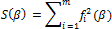
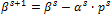
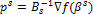
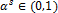
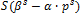
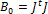
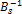
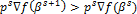

# Квазиньютоновский метод

Квазиньютоновский метод
-

# Квазиньютоновский метод

Пусть имеется m функций f1(β), …, fm(β)
 от n переменных β = (β1, …, βn). Требуется минимизировать сумму квадратов:

Имея начальное приближение β0, очередное
 приближение находят по формуле:

,

Где:

	- . Направление для поиска;

	- . Длина шага. Находится с помощью
	 линейного поиска как предположительный минимум по α одномерной функции
	 . Здесь Bs - приближение
	 матрицы Гессе функции S в
	 точке βs;

	- ∇ f - градиент
	 вектора функций f1, …, fm
	 в точке βs.

На первой итерации матрица Гессе приближается матрицей ,
 где J - якобиан функции S в точке β0,
 т.е. выбирается направление Гаусса-Ньютона. В последующем, приближение
 обратной матрицы Гессе  обновляется
 с помощью BFGS-формулы (Broyden-Fletcher-Goldfarb-Shanno) при выполнении
 условия  и остается неизменным.

Если на очередной итерации процедура линейного поиска показала, что
 ни при каком значении шага αs целевая
 функция не уменьшается, то направление ps
 меняется на направление Гаусса-Ньютона (как на первой итерации) и длина
 шага заново пересчитывается. Если и после этого не удается найти приемлемое
 значение шага, то алгоритм заканчивает работу.

Итерационный метод останавливается, если выполнено одно из условий останова:

	- относительное изменение искомой точки на очередной итерации
	 не превысило заданное значение точности;

	- достигнуто заданное максимальное количество итераций;

	- очередная итерация не привела к уменьшению исследуемую целевую
	 функцию (сумму квадратов).

См. также:

[Библиотека методов и моделей](../uimodelling_lib_common.htm)
 | [ARIMA](UiModelling_ARIMA.htm)
 | [Оценка коэффициентов модели ARIMA](Lib_ARIMA_Coef.htm)

		Справочная
		 система на версию 10.9
		 от 18/08/2025,
		 © ООО «ФОРСАЙТ»,
