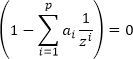

# Стационарность и характеристические корни

Стационарность и характеристические корни
-

# Стационарность и характеристические корни

Авторегрессионный процесс является стационарным, если все корни характеристического
 уравнения

лежат внутри единичного круга комплексной плоскости, то есть |z| < 1.

Если имеются корни, равные по модулю единице (теоретически могут быть
 и больше единицы), то авторегрессионный процесс является нестационарным.

См. также:

[Библиотека
 методов и моделей](../uimodelling_lib_common.htm) | Контейнер моделирования: [Характеристические
 корни AR и MA процессов](UiModelling.chm::/Web/ResultsPanel/w_rp_root_AR_MA.htm)

		Справочная
		 система на версию 10.9
		 от 18/08/2025,
		 © ООО «ФОРСАЙТ»,
