# ARIMA

ARIMA
-

# ARIMA

Модель ARIMA - одна из наиболее
 популярных моделей для построения краткосрочных прогнозов. Для описания
 данной модели используются три группы параметров, описанные ниже.

## Параметры несезонных авторегрессии AR(p)
 и скользящего среднего MA(q)

Процесс авторегрессии p-го
 порядка в его классическом понимании может быть представлен в форме:

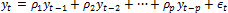

или:

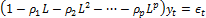

где:

	- L.
	 Лаговый оператор: 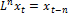;

	- 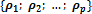.
	 Коэффициенты авторегрессии.

Также может быть рассмотрена модель, в которой некоторые авторегрессионные
 коэффициенты предполагаются равными нулю. При таких условиях зависимость,
 к примеру, текущего значения yt только от
 yt-4 будет описана моделью:

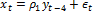

или:

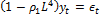

Процесс скользящего среднего q-го
 порядка в его классическом понимании может быть представлен в форме:

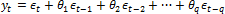

или

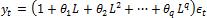

где:

	- {θ1; θ2; …; θq}. Коэффициенты скользящего среднего.

Процесс также может быть смоделирован при равенстве нулю некоторых отдельных
 коэффициентов, например:

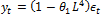

## Параметры сезонной авторегрессии SAR(P)
 и сезонного скользящего среднего SMA(Q)

Модель ARIMA может учитывать
 и сезонную авторегрессию. Так для квартальной сезонности модель с авторегрессией
 p-го порядка с учетом сезонной
 авторегрессии первого порядка будет следующая:

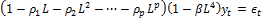

где:

	- β. Коэффициент сезонной
	 авторегрессии первого порядка.

При p = 0, т.е. при
 отсутствии несезонной авторегрессии, модель с сезонной авторегрессией
 трансформируется в простую авторегрессионную модель вида:

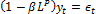

Сезонное скользящее среднее первого порядка, по аналогии с сезонной
 авторегрессией, для кварталов рассчитывается по формуле:

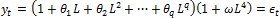

где:

	- ω.
	 Коэффициент сезонного скользящего среднего первого порядка.

Параметры описанных групп позволяют построить модель ARMA
 (модель авторегрессионного скользящего среднего):

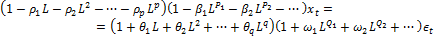

где:

	- L.
	 Лаговый оператор;

	- . Коэффициенты авторегрессии p-го порядка;

	- {β1; β2; …}. Коэффициенты сезонной
	 авторегрессии;

	- {θ1; θ2; …; θq}. Коэффициенты скользящего среднего q-го порядка;

	- {ω1; ω2; …}. Коэффициенты сезонного
	 скользящего среднего;

	- {P1; P2; …}.
	 Определяются как период сезонности, умноженный на порядок сезонной
	 авторегрессии;

	- {Q1; Q2; …}.
	 Определяются как период сезонности, умноженный на порядок сезонной
	 авторегрессии.

Модель ARIMA (модель проинтегрированного
 авторегрессионного скользящего среднего) является обобщением модели ARMA и строится в два этапа:

	- Дифференцирование исходного ряда (если это необходимо).

	- Описание продифференцированного ряда с помощью модели ARMA.

Необходимость дифференцирования исходного ряда возникает при отсутствии
 стационарности. Например, при наличии ярко выраженной тенденции к росту.
 В данном случае более правильно применять модель ARMA
 к ряду, содержащему значения прироста исходного ряда.

## Параметры дифференцирования исходного ряда: d,
 D, s

Обычный оператор дифференцирования выглядит следующим образом:

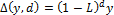

где d - порядок дифференцирования.

При дифференцировании данных можно учесть их сезонность. Пример дифференцирования
 квартальных данных:

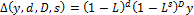

где:

	- d.
	 Порядок несезонного дифференцирования;

	- D.
	 Порядок сезонного дифференцирования;

	- s.
	 Период сезонности.

Задавая порядок несезонного дифференцирования равным нулю, можно использовать
 только сезонное дифференцирование:

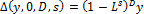

## Особенности модели

Сезонные и несезонные параметры должны удовлетворять неравенству:

C − (p + P + D + D·s) > 1

где:

	- C.
	 Длина исходного ряда;

	- p.
	 Максимальный порядок авторегрессии;

	- P.
	 Максимальный порядок сезонной авторегрессии;

	- d.
	 Разность;

	- D.
	 Сезонная разность;

	- s.
	 Период сезонности.

При наличии пропусков внутри исходного ряда количество используемых
 для расчета значений уменьшается на n·(p + P
 + D + D·s), где n
 - количество пропусков в исходном ряде.

Модель ARIMA предполагает, что
 ϵt
 - последовательность независимых одинаково распределенных случайных величин,
 имеющих нормальное распределение вероятностей с нулевым математическим
 ожиданием и некоторой дисперсией σ2.
 Если после оценивания параметров это предположение не выполняется, то
 выбранная спецификация модели некорректна.

Необходимо отметить, что модель ARMA
 предполагает стационарность моделируемого ряда. В таком случае все корни
 характеристических уравнений для процессов авторегрессии и скользящего
 среднего должны лежать внутри единичного круга в комплексной плоскости.

Корни для AR-процесса находятся из уравнения:

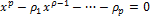

Корни для MA-процесса находятся из уравнения

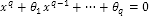

Если после оценивания параметров предположение о том, что корни лежат
 внутри единичного круга, не выполняется, то полученный процесс является
 нестационарным.

См. также:

[Библиотека
 методов и моделей](../uimodelling_lib_common.htm) | [Модель регрессии
 с авторегрессионными остатками и скользящим средним](UiModelling_regr_ARMA.htm) | [Оценка
 коэффициентов модели ARIMA](Lib_ARIMA_Coef.htm) | Контейнер моделирования: модель «[ARIMA](UiModelling.chm::/2_Container_of_Modeling/2_3_Work_object/2_3_2_Model/Specification/1_Arima/uimodelling_model_specification_arima.htm)»
 | Анализ временных рядов: [ARIMA](UiDw.chm::/Workbook/CalculatedSeries/Forecast/UiDw_cs_ARIMA.htm)
 | [Modelling.Arima](KeMs.chm::/Interface/IModelling/IModelling.Arima.htm) |
  [ISmLinearRegress](StatLib.chm::/Interface/ISmLinearRegress/ISmLinearRegress.htm)

		Справочная
		 система на версию 10.9
		 от 18/08/2025,
		 © ООО «ФОРСАЙТ»,
