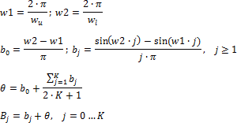
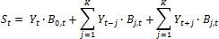

# Фильтр Бакстера-Кинга

Фильтр Бакстера-Кинга
-

# Фильтр Бакстера-Кинга

Полосно-пропускающий фильтр Бакстера-Кинга
 - это метод сглаживания временного ряда, который является модификацией
 [фильтра Ходрика-Прескотта](UiModelling_HodrickPrescottFilter.htm)
 с более широкими возможностями исключения циклической составляющей во
 временном ряде.

Процедура фильтрации заключается в выделении повторяющейся компоненты
 временного ряда путём задания ширины колебаний периодической составляющей.
 Фильтр Бакстера-Кинга - это линейный фильтр, который выделяет из временного
 ряда Y циклическую составляющую
 S на основе взвешенного скользящего
 среднего с определёнными весами. Для вычисления весов задают частоты отсечения,
 характеризующие допустимые несезонные колебания сглаживаемого ряда.

Пусть wu,
 wl
 - верхняя и нижняя частоты отсечения соответственно. Тогда веса Bj
 для заданного лага/опережения K
 будут вычисляться по следующим формулам:

Сезонная (циклическая) составляющая исходного ряда рассчитывается по
 формуле:

где:

	- Bj. Весовое
	 значение, соответствующее значению исходного ряда Y,
	 которое находится на расстоянии j
	 от текущего элемента;

	- K.
	 Задает опережение/лаг, с которым рассчитывается скользящее среднее.

Результатом сглаживания является исходный ряд с исключённой сезонной
 (циклической) составляющей.

Для случая нестационарного временного ряда применяют обобщенный фильтр
 Бакстера-Кинга. Нестационарность учитывается в матрице весов, которые
 в обобщенной модели зависят от номера наблюдения. В таком случае формула
 для расчета сезонной составляющей следующая:

где:

	- Bj,t. Весовое значение,
	 соответствующее значению исходного ряда Y,
	 которое находится на расстоянии j
	 от элемента Yt.

	- K.
	 Задает опережение/лаг, с которым рассчитывается скользящее среднее.

Существуют рекомендуемые значения опережения/лага, верхней и нижней
 границ частот пропускания в зависимости от календарной динамики исходного
 ряда:

		 Динамика
		 Опережение/лаг
		 Нижняя граница
		 Верхняя граница

		 Годовая
		 3
		 2
		 8

		 Полугодовая
		 6
		 3
		 16

		 Квартальная
		 12
		 6
		 32

		 Месячная
		 36
		 8
		 96

		 Недельная
		 156
		 78
		 416

		 5-дневная
		 783
		 391,5
		 2088

		 7-дневная
		 1095
		 547,5
		 2920

См. также:

[Библиотека методов и моделей](../uimodelling_lib_common.htm)
 | Контейнер моделирования: модель «[Фильтр
 Бакстера-Кинга](UiModelling.chm::/2_Container_of_Modeling/2_3_Work_object/2_3_2_Model/Specification/UiModelling_Specification_BaxterKingFilter.htm)» | Анализ временных рядов: [Фильтр
 Бакстера-Кинга](UiDw.chm::/Workbook/CalculatedSeries/Smoothing/UiDw_cs_BandpassFilter.htm) | [IModelling.Bpf](KeMs.chm::/Interface/IModelling/IModelling.Bpf.htm) |
 [ISmBandpassFilter](StatLib.chm::/Interface/ISmBandpassFilter/ISmBandpassFilter.htm)

		Справочная
		 система на версию 10.9
		 от 18/08/2025,
		 © ООО «ФОРСАЙТ»,
