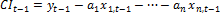
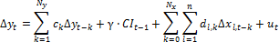
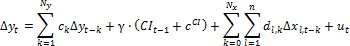
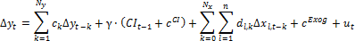

# Модель коррекции ошибок

Модель коррекции ошибок
-

# Модель коррекции ошибок

Предполагается, что коинтегрированные процессы Y1t
 и Y2t связаны
 между собой долгосрочным стационарным соотношением. Из этого следует гипотеза,
 что существует некий корректирующий механизм, который при отклонениях
 возвращает Y1t и Y2t к их долгосрочному
 отношению.

В общем виде модель записывается в виде:

Где:

	- Yt.
	 Эндогенная переменная;

	- Ny.
	 Величина лага эндогенной переменной;

	- x1,t, …, xn,t.
	 Экзогенные переменные;

	- Nx.
	 Величина лага экзогенных переменных;

	- ut.
	 Стандартная ошибка;

	- ck, al, dl,k,
	 γ. Оцениваемые коэффициенты модели коррекции ошибок;

	- cCI.
	 Константа в коинтеграционном уравнении;

	- cExog.
	 Тренд в исходных данных (в авторегрессии).

Изучаемая модель может содержать ненулевое среднее, или тренд. Аналогично
 коинтеграционные уравнения могут содержать константу и тренд.

Обозначим: 

Допустимы следующие виды модели:

	- модель без тренда в авторегрессии, без константы в коинтеграционном
	 уравнении:

	- модель без тренда в авторегрессии, с константой в коинтеграционном
	 уравнении:

	- модель с трендом в авторегрессии, с константой в коинтеграционном
	 уравнении:

См. также:

[Библиотека
 методов и моделей](../uimodelling_lib_common.htm) | [Коинтегрированные
 процессы](Lib_CointegrProcesses.htm) | [Векторная модель коррекции ошибок](Lib_VECM.htm) |
 Контейнер моделирования: «[Модель
 коррекции ошибок](UiModelling.chm::/2_Container_of_Modeling/2_3_Work_object/2_3_2_Model/Specification/UiModelling_Specification_Error_control.htm)» | Анализ временных рядов: [Модель
 коррекции ошибок](UiDw.chm::/Workbook/CalculatedSeries/Regression/UiDw_cs_ErrorCorrectionModel.htm) | [IModelling.Ecm](KeMs.chm::/Interface/IModelling/IModelling.Ecm.htm)
 | [ISmErrorCorrectionModel](StatLib.chm::/Interface/ISmErrorCorrectionModel/ISmErrorCorrectionModel.htm)

		Справочная
		 система на версию 10.9
		 от 18/08/2025,
		 © ООО «ФОРСАЙТ»,
