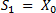
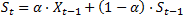
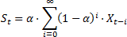
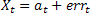
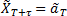
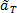
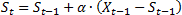

# Экспоненциальное сглаживание

Экспоненциальное сглаживание
-

# Экспоненциальное сглаживание

Экспоненциальное сглаживание
 является одним из наиболее распространенных приемов, используемых для
 сглаживания временных рядов, а также для прогнозирования. В основе процедуры
 сглаживания лежит расчёт экспоненциальных скользящих средних сглаживаемого
 ряда.

Главное достоинство прогнозной модели, основанной на экспоненциальных
 средних, состоит в том, что она способна последовательно адаптироваться
 к новому уровню процесса без значительного реагирования на случайные отклонения.

Исторически метод независимо был разработан Брауном и Холтом. Холт также
 разработал модели экспоненциального сглаживания для процессов с постоянным
 уровнем, процессов с линейным ростом и процессов с сезонными эффектами.

Процедура простого экспоненциального сглаживания осуществляется по следующим
 формулам:

где:

	- Xt-1. Фактическое
	 наблюдение в момент t-1;

	- St.
	 Значение экспоненциального среднего в момент t;

	- α.
	 Параметр сглаживания, α = const, α ϵ (0, 1].

Экспоненциальное среднее в момент t
 здесь выражено как взвешенная сумма текущего наблюдения и экспоненциального
 среднего прошлого наблюдения с весами α
 и (1 - α) соответственно.
 Если последовательно использовать данное рекуррентное соотношение, то
 значение St
 можно выразить через значения временного ряда X:

Таким образом, величина St оказывается
 взвешенной суммой всех членов ряда. Причем значения весов уменьшаются
 экспоненциально в зависимости от удаленности наблюдения относительно момента
 t. Это и объясняет название «экспоненциальное
 среднее».

Экспоненциальное сглаживание можно представить как фильтр, на вход которого
 в виде потока последовательно поступают члены исходного ряда, а на выходе
 формируются значения экспоненциальных средних. Причем, сглаженный ряд
 St
 имеет тоже математическое ожидание, что и ряд X,
 но меньшую дисперсию.

При высоком значении α дисперсия
 сглаженного ряда не значительно отличается от дисперсии ряда X.
 Чем меньше α, тем в большей степени
 сокращается дисперсия сглаженного ряда (то есть подавляются колебания
 исходного ряда).

Далее экспоненциальное среднее можно использовать для построения краткосрочных
 прогнозов. В этом случае предполагается, что исходный ряд описывается
 моделью:

где:

	- at.
	 Изменяющийся во времени средний уровень ряда;

	- errt.
	 Случайные неавтокоррелированные отклонения с нулевым математическим
	 ожиданием.

Прогнозная модель имеет вид:

где:

	- . Прогноз, сделанный
	 в момент T на τ единиц времени
	 (шагов) вперед;

	- . Оценка aT.

Оценкой параметра модели aT служит экспоненциальное
 среднее ряда ST. Таким образом, все свойства экспоненциального
 среднего распространяются на прогнозную модель. В частности, если привести
 рекуррентную формулу к следующему виду:

и рассматривать St-1
 как прогноз на один шаг вперед, то величина (Xt-1 - St-1) есть погрешность этого прогноза,
 а новый прогноз St получается в результате корректировки
 предыдущего прогноза с учетом его ошибки. В этом и состоит сущность адаптации.

На основе простого экспоненциального сглаживания были разработаны более
 сложные модели сглаживания временных рядов, содержащих периодические сезонные
 колебания и/или обладающих тенденцией роста.

Данная система позволяет строить наряду с простым экспоненциальным сглаживанием
 модели, отражающие эффекты роста (линейного, экспоненциального или затухающего)
 и сезонности (аддитивного или мультипликативного), которыми обладает исходный
 ряд.

В общем виде рекуррентная формула экспоненциального сглаживания записывается
 следующим образом:

где множители d1
 и d2
 определяются в зависимости от выбранной модели сглаживания. К примеру,
 при простом экспоненциальном сглаживании, рассмотренном выше, d1 = Xt, d2 = St-1.

См. также:

[Модель
 с сезонными эффектами](UiModelling_ExpSmooth_season.htm) | [Модели
 роста](UiModelling_ExpSmooth_growthhtm.htm) | [Метод наилучшей пробы](Lib_BestTrialMethod.htm)
 | Контейнер моделирования: модель «[Экспоненциальное
 сглаживание](UiModelling.chm::/2_Container_of_Modeling/2_3_Work_object/2_3_2_Model/Specification/5_Exponential_smoothing/uimodelling_model_specification_exponential.htm)» | Анализ временных рядов: «[Экспоненциальное
 сглаживание](UiDw.chm::/Workbook/CalculatedSeries/Forecast/UiDw_cs_ExponentialSmoothing.htm)» | [IModelling.Expsmooth](KeMs.chm::/Interface/IModelling/IModelling.Expsmooth.htm)
 | [ISmExponentialSmoothing](StatLib.chm::/Interface/ISmExponentialSmoothing/ISmExponentialSmoothing.htm)

		Справочная
		 система на версию 10.9
		 от 18/08/2025,
		 © ООО «ФОРСАЙТ»,
