# Модели роста

Модели роста
-

# Модели роста

## Линейный, экспоненциальный, затухающий

Временные ряды часто имеют тенденцию некоторого роста (убывания). При
 сглаживании таких рядов простым экспоненциальным сглаживанием значение
 экспоненциального среднего будет постоянно отставать от значения временного
 ряда, и чем меньше α, тем больше
 будет это отставание. Поэтому для таких случаев требуются модели, которые
 учитывали бы темпы прироста (убывания) в уровне временного ряда на каждом
 шаге.

В обобщенной модели экспоненциального сглаживания

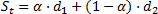

рост (затухание) учитывает компонента d2.

Если каждое последующее значение исходного ряда отличается от предыдущего
 значения на некоторую достаточно устойчивую величину, то данный ряд имеет
 тенденцию линейного роста (убывания).
 В этом случае, в модель экспоненциального сглаживания добавляется коэффициент,
 учитывающий данную особенность, а именно:

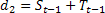

где:

	- 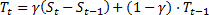. Компонента линейного роста.

Однако с течением времени в динамике ряда может наблюдаться падение
 темпа роста (убывания) и приближение уровней ряда к некоторой асимптоте.
 Данную особенность (рост или падение с насыщением) учитывает модель затухающего роста, которая предполагает:

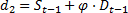

где:

	- 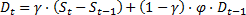. Компонента затухающего роста.

Если динамика исходного ряда предполагает некоторый пропорциональный
 рост (убывание) (то есть каждое последующее значение ряда получается путем
 умножения предыдущего значения на некоторый постоянный коэффициент), то
 такой рост называется экспоненциальным, а модель, отражающая свойства
 такого процесса, – моделью экспоненциального
 роста, для которой:

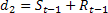

где:

	- . Компонента экспоненциального роста.

Таким образом, если компонента роста включается в модель экспоненциального
 сглаживания, то он пересчитывается на каждом шаге в зависимости от предыдущего
 своего значения и приспосабливается к изменениям сглаженного ряда на этом
 шаге. Значения параметра γ принадлежат
 интервалу [0, 1]. Причем, если параметр γ
 равен нулю, то данный коэффициент не реагирует на изменения сглаженного
 ряда (а значит и исходного), а в случаях линейного и экспоненциального
 роста является постоянным для любого момента времени; в случае затухающего
 роста уменьшается под влиянием параметра ϕ. Если γ
 равен 1, то коэффициент роста зависит только от текущего изменения сглаженного
 ряда. Параметр ϕ в случае затухающего роста означает, в какой степени
 текущий коэффициента роста будет ослаблен по сравнению с предыдущим. Значения
 параметра ϕ принадлежат интервалу (0, 1).

Обозначим:

	- E.
	 Последняя точка периода идентификации;

	- τ. Количество точек
	 прогноза.

Приведем в таблице модели прогноза значений временного ряда в зависимости
 от характера роста и сезонного эффекта:

		 Характер роста
		 Сезонный эффект

		 Отсутствует
		 Аддитивный
		 Мультипликативный

		 Отсутствует
		 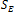
		 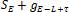
		 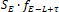

		 Линейный
		 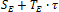
		 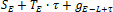
		 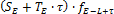

		 Экспоненциальный
		 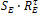
		 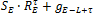
		 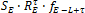

		 Затухающий
		 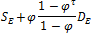
		 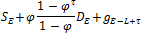
		 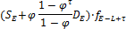

В общем случае, вычисленный уровень сглаженного ряда в последней точке
 периода идентификации корректируется на коэффициент роста на τ точек вперед,
 после чего на полученный прогноз накладывается сезонная составляющая.

См. также:

[Экспоненциальное сглаживание](UiModelling_ExpSmooth.htm)
 | Экспоненциальное сглаживание: [модель с сезонными эффектами](UiModelling_ExpSmooth_season.htm)
 | [Метод наилучшей пробы](Lib_BestTrialMethod.htm)

		Справочная
		 система на версию 10.9
		 от 18/08/2025,
		 © ООО «ФОРСАЙТ»,
