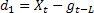
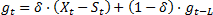
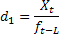
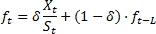

# Модель с аддитивным и мультипликативным сезонными эффектами

Модель с аддитивным и мультипликативным сезонными эффектами
-

# Модель с аддитивным и мультипликативным сезонными эффектами

Под сезонностью понимают влияние внешних факторов, действующих циклически
 с заранее известной периодичностью. Временной ряд и содержащиеся в нем
 периодические сезонные колебания, можно представить, как генерируемые
 модели двух основных типов: с аддитивными и мультипликативными сезонными
 составляющими.

Если в исходном ряде наблюдаются достаточно постоянные периодические
 отклонения в абсолютном выражении от варьирующего во времени среднего
 уровня ряда с заранее известным периодом, то сезонная составляющая имеет
 аддитивную природу, и в модель
 экспоненциального сглаживания для отражения этой особенности добавляется
 дополнительный параметр, который обычно обозначается, как δ.
 Тогда в модели

,

где:

	- . Аддитивная сезонная
	 составляющая;

	- L.
	 Период сезонности.

Параметр δ может принимать
 значения из промежутка от 0 до 1. Причем, если δ = 0,
 то сезонная составляющая в данный момент времени будет идентична сезонной
 компоненте в соответствующей точке предыдущего сезонного цикла. Таким
 образом, неменяющаяся сезонная составляющая используется для генерации
 прогнозного значения на один шаг вперед. Если δ = 1,
 то сезонная составляющая в текущий момент времени равна текущей ошибке
 моделирования. В большинстве случаев, когда сезонность присутствует в
 исходном ряде, оптимальное значение параметра δ
 располагается между нулем и единицей.

Особенностью мультипликативной
 модели является то, что сезонные отклонения от изменяющегося во времени
 среднего уровня исходного ряда носят характер достаточно устойчивого относительного
 изменения (то есть для каждой точки сезонного цикла определено изменение
 относительно данного уровня). Таким образом:

,

где:

	- . Мультипликативная
	 сезонная составляющая.

См. также:

[Библиотека методов и моделей](../uimodelling_lib_common.htm)
 | [Экспоненциальное
 сглаживание](UiModelling_ExpSmooth.htm) | Экспоненциальное сглаживание. [Модели роста](UiModelling_ExpSmooth_growthhtm.htm)
 | [Метод наилучшей пробы](Lib_BestTrialMethod.htm)

		Справочная
		 система на версию 10.9
		 от 18/08/2025,
		 © ООО «ФОРСАЙТ»,
