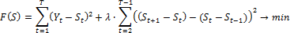
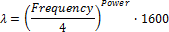

# Фильтр Ходрика-Прескотта

Фильтр Ходрика-Прескотта
-

# Фильтр Ходрика-Прескотта

Фильтр Ходрика-Прескотта - это
 метод сглаживания временного ряда, который используется для выделения
 длительных тенденций временного ряда. Метод впервые был использован для
 анализа бизнес-циклов послевоенной экономики США.

Фильтр представляет собой двухсторонний линейный фильтр, который вычисляет
 сглаженный ряд S временного ряда
 Y путём минимизации рассеивания
 элементов ряда S вокруг Y при условии минимума суммы элементов
 дважды дифференцированного ряда S.

В математическом выражении элементы сглаженного ряда S
 выбираются таким образом, чтобы минимизировать следующую функцию:

Параметр λ управляет мерой гладкости ряда S.
 Чем больше значение λ, тем более гладким получается ряд S.
 При λ → ∞ ряд S превращается
 в линейный тренд, при λ = 0 ряд S
 совпадает с исходным рядом Y.

Рекомендуется выбирать значение λ в зависимости от динамики исследуемого
 ряда. Например: для годовых данных предпочтительным является λ = 100,
 для квартальных данных - λ = 1600, для месячных данных - λ = 14400.

Параметр λ также может быть рассчитан в зависимости от динамики ряда
 и значения степени Power по следующей
 формуле:

где Frequency - количество
 периодов в году. Рекомендуемое значение данного параметра равно 2.

См. также:

Контейнер моделирования: модель
 «[Фильтр
 Ходрика-Прескотта](UiModelling.chm::/2_Container_of_Modeling/2_3_Work_object/2_3_2_Model/Specification/10_Filter_Hodrika_Preskotta/10_filter_hordrika_preskotta.htm)» | Анализ временных рядов: «[Фильтр
 Ходрика-Прескотта](UiDw.chm::/Workbook/CalculatedSeries/Smoothing/UiDw_cs_HodrickPrescottFilter.htm)» | [IModelling.Hpf](KeMs.chm::/Interface/IModelling/IModelling.Hpf.htm)
 | [IModelling.Hpfp](KeMs.chm::/Interface/IModelling/IModelling.Hpfp.htm)

 | [ISmHodrickPrescottFilter](StatLib.chm::/Interface/ISmHodrickPrescottFilter/ISmHodrickPrescottFilter.htm)

		Справочная
		 система на версию 10.9
		 от 18/08/2025,
		 © ООО «ФОРСАЙТ»,
