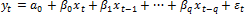
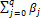
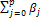
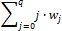
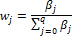

# Модели распределенных лагов

Модели распределенных лагов
-

# Модели распределенных лагов

Модели с распределенными лагами
 - это модели, содержащие в качестве лаговых переменных лишь независимые
 (объясняющие) переменные.

Данные модели широко используются в эконометрическом анализе, т.к. во
 многих случаях воздействие одних экономических факторов на другие осуществляется
 не мгновенно, а с некоторым временным запаздыванием - лагом. Метод распределенных
 лагов позволяет исследовать такого рода воздействие.

Пусть исследуется показатель Y.
 Его значение в текущий момент времени - yt; значения
 Y в последующие моменты времени
 - yt+1, yt+2, …,
 yt+q;
 значения Y в предыдущие моменты времени - yt-1, yt-2, …, yt-q.

В случае отсутствия авторегрессионных членов модель распределенных лагов
 - это модель вида:

где:

	- xt.
	 Лагированные значения экзогенных переменных;

	- βq.
	 Краткосрочный мультипликатор. Характеризует изменение среднего значения
	 Y в момент времени t под воздействием единичного изменения
	 переменной X в момент времени
	 t-q.

Сумма всех коэффициентов при экзогенных переменных 
 - долгосрочный мультипликатор. Он характеризует изменение Y
 под воздействием единичного изменения переменной X
 в каждом из рассматриваемых временных периодов.

Любую сумму коэффициентов  (p < q) называют промежуточным
 мультипликатором.

Для измерения скорости реакции Y
 на изменение Х рассматривается
 величина среднего лага:

где:

 - это вклад отдельного лага
 или распределение лага.

Малые значения среднего лага соответствуют быстрой реакции Y
 на изменение Х, большим значениям
 среднего лага соответствует замедленная реакция.

См. также:

[Библиотека методов и моделей](../uimodelling_lib_common.htm)
 | [Модель полиноминально распределенных
 лагов](Lib_PolinDistrLags_Almon.htm) | [Модель геометрически
 распределенных лагов](Lib_GeomDistrLags_Koyck.htm) | Контейнер моделирования: модель «[Линейная
 регрессия (оценка МНК)](UiModelling.chm::/2_Container_of_Modeling/2_3_Work_object/2_3_2_Model/Specification/8_Linear_regression/uimodelling_model_specification_linaer_reg.htm)» | [ISmLinearRegress](StatLib.chm::/Interface/ISmLinearRegress/ISmLinearRegress.htm)

		Справочная
		 система на версию 10.9
		 от 18/08/2025,
		 © ООО «ФОРСАЙТ»,
