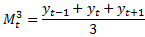
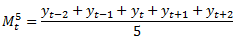
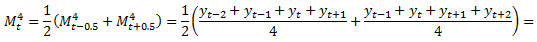
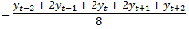

# Скользящее среднее

Скользящее среднее
-

# Скользящее среднее

Метод скользящего среднего
 основан на представлении ряда в виде суммы достаточно гладкого тренда
 и случайной компоненты.

В основе метода лежит идея локального приближения тренда полиномом не
 очень высокой степени. Для построения оценки тренда в точке t
 к значениям ряда из временного интервала [t - w, t + w]
 с помощью метода наименьших квадратов подбирается полином заданного порядка
 p. Эта процедура в действительности
 эквивалентна построению взвешенной суммы значений ряда в интервале [t - w, t + w]
 с весами, зависящими от ширины интервала 2 w + 1
 и порядка полинома p. Для полинома
 порядка p = 1 веса
 равны между собой. В частности, по этой причине метод называют методом
 скользящих средних.

Скользящие средние также вычисляют, когда неясно, какую подходящую функцию
 нужно подобрать для тренда. Значение скользящего среднего в момент времени
 t - это среднее арифметическое
 подряд идущих значений временного ряда на интервале времени, в центре
 которого - точка t.

Обозначим через Mtp
 значение скользящего среднего в момент времени t,
 определенное по p точкам. Например:

И так далее.

Из сказанного очевидно, что число p
 точек должно быть нечетным, иначе среднее арифметическое нужно отнести
 к дробному моменту времени. На практике, однако, нередки случаи, когда
 p удобно выбрать четным. Тогда
 вычисляют не простое среднее арифметическое, а с некоторыми весами. Например,
 если положить p = 4,
 можно рассчитать Mt4 так:

Расчет скользящего среднего по четырем точкам свелся к расчету по пяти
 точкам с набором весов (1, 2, 2, 2, 1). Описанный прием расчета скользящего
 среднего по четному количеству точек называется центрированием.

См. также:

Контейнер моделирования: модель
 «[Скользящее
 среднее](UiModelling.chm::/2_Container_of_Modeling/2_3_Work_object/2_3_2_Model/Specification/2_Slitherring_smoothing/2_Slitherring_smoothing.htm)» | Анализ временных рядов: «[Скользящее
 среднее](UiDw.chm::/Workbook/CalculatedSeries/Smoothing/UiDw_cs_MovingAverage.htm)» | [IModelling.Movavg](KeMs.chm::/Interface/IModelling/IModelling.Movavg.htm)
 | [ISmSlideSmoothing](StatLib.chm::/Interface/ISmSlideSmoothing/ISmSlideSmoothing.htm)

		Справочная
		 система на версию 10.9
		 от 18/08/2025,
		 © ООО «ФОРСАЙТ»,
