# Тренд с подбором функциональной зависимости

Тренд с подбором функциональной зависимости
-

# Тренд с подбором функциональной зависимости

## Тренд

Тренд - неслучайная медленно
 меняющаяся составляющая временного ряда, на которую могут накладываться
 случайные колебания или сезонные эффекты.

Для коротких временных рядов наиболее употребительны параметрические
 методы выделения тренда. В этом случае делается попытка представить временной
 ряд в виде суммы детерминированной функции времени F
 (t, a)
 (a - вектор неизвестных параметров),
 зависящей от небольшого числа неизвестных параметров и случайной компоненты
 err (t).
 Таким образом, если динамика исследуемого процесса представляет собой
 временной ряд Y(t),
 где t = 1,…, N, то трендовая модель будет выглядеть
 следующим образом:

Y(t) = F(t, a) + err(t)

Где:

	- F(t, a). Функция тренда;

	- err(t). Стационарный временной ряд с
	 нулевым средним (ошибка моделирования).

## Виды функциональных зависимостей

Для оценки вектора неизвестных параметров a
 применяется метод наименьших квадратов. Для применения данного метода
 функция F (t,
 a) должна быть линейного вида
 или поддаваться линеаризации (приведению к линейному виду).

Основные виды зависимостей:

	- Линейная. 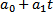;

	- Квадратичная. 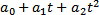;

	- Полиномиальная. 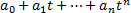;

	- Составная. 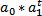;

	- Уравнение роста. 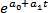;

	- Логарифмическая. 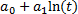;

	- Гиперболическая. 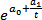;

	- Экспонентная. 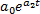;

	- Обратная. 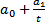;

	- Степенная. 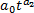;

	- Логистическая. 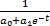;

	- Квадратный корень. 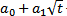;

	- Логарифмическая-параболическая.
	 .

	Для линеаризации нелинейной функции
	 необходимо применить логарифмическое преобразование. Например, 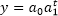 будет преобразовано в линейную функцию
	 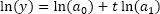 или 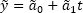. Оценки МНК
	 ищутся для параметров 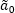, 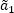,
	 а исходные параметры получаются путем обратного преобразования: 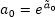,
	 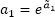.

## Сезонность

Сезонность - компонента
 временного ряда, отражающая повторяемость экономических процессов в течение
 небольших промежутков времени, обычно это влияние внешних факторов, действующих
 циклически с заранее известной периодичностью.

Временной ряд и его сезонные колебания можно представить в различных
 видах: с аддитивным и мультипликативным коэффициентами сезонности. Таким
 образом, неслучайная компонента ряда раскладывается на две составляющие:

	- F(t) = P(t) + S(t). Аддитивная модель;

	- F(t) = P(t) · S(t). Мультипликативная модель.

Где:

	- P(t). Тренд без сезонного фактора из
	 выбранного параметрического семейства;

	- S(t). Сезонная составляющая (коэффициент
	 сезонности), которая предполагается периодической с целочисленным
	 периодом сезонности L, то
	 есть S(t) = S(t + L).

## Методы вычисления сезонности

Для учета аддитивной сезонности используется метод фиктивных переменных.
 Суть метода заключается в добавлении в модель фиктивных переменных, каждая
 из которых является индикатором принадлежности наблюдения к определенном
 сезону.

y = F(t, a) + c1s1 + c2s2 + … + cL-1sL-1

Где:

	- sl.
	 Сезонные фиктивные переменные:

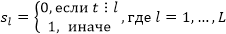

	- c1,…,cL-1. Коэффициенты
	 при них.

Число фиктивных переменных должно быть на 1 меньше, чем число сезонов,
 т.к. коэффициент для последнего сезона будет определяться однозначно на
 основе значений коэффициентов для других сезонов.

После получения оценок коэффициентов модели необходимо провести преобразование
 для вычисления сезонных компонент на основе условия:

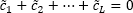

Итоговая модель расчета тренда с аддитивной сезонностью будет выглядеть
 следующим образом:

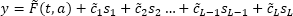

Где:

	- 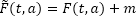

	- 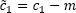

	- 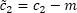

	- …

	- 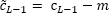

	- 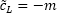, где 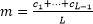

Данный метод учета сезонности применим для линейных моделей. Если исходная
 модель требует линеаризации, этот метод используется для определения мультипликативной
 сезонности.

Для учета мультипликативной сезонности в линейных моделях используется
 метод Census1. Этот метод позволяет исключить сезонность, прежде чем оценивать
 коэффициенты модели тренда. В случае, если исходная модель требует линеаризации,
 этот метод используется для определения аддитивной сезонности.

См. также:

Контейнер моделирования: модель
 «[Тренд
 с подбором функциональной зависимости](UiModelling.chm::/2_Container_of_Modeling/2_3_Work_object/2_3_2_Model/Specification/9_Universal_graph/9_universal_graph.htm)» | Анализ временных
 рядов: [Тренд](UiDw.chm::/Workbook/CalculatedSeries/Forecast/UiDw_cs_Exponential_Trend.htm) |
 [IModelling.Extrapolate](KeMs.chm::/Interface/IModelling/IModelling.Extrapolate.htm)
 | [ISmCurveEstimation](StatLib.chm::/Interface/ISmCurveEstimation/ISmCurveEstimation.htm)

		Справочная
		 система на версию 10.9
		 от 18/08/2025,
		 © ООО «ФОРСАЙТ»,
