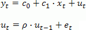
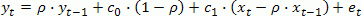
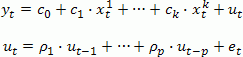
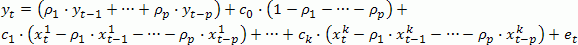
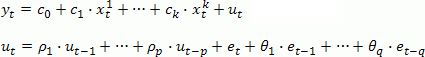
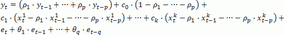

# Модель регрессии с авторегрессионными остатками и скользящим средним

Модель регрессии с авторегрессионными остатками и скользящим средним
-

# Модель регрессии с авторегрессионными остатками и скользящим средним

Данная модель является объединением модели [ARIMA](UiModelling_ARIMA.htm)
 и модели регрессии.

Рассматриваются различные авторегрессионные процессы:

	- авторегрессионный процесс первого порядка c одной объясняющей
	 переменной x:

Для оценки коэффициентов эта линейная модель
 приводится к нелинейной:

	- авторегрессионный процесс произвольного порядка p
	 с объясняющими переменными x1, x2, …, xk:

Для оценки коэффициентов эта линейная модель
 приводится к нелинейной:

	- авторегрессионный процесс произвольного порядка p
	 с объясняющими переменными x1, x2, …, xk
	 и скользящими средними порядка q:

Для оценки коэффициентов эта линейная модель
 приводится к нелинейной:

В приведенных формулах ut - это остатки
 модели без составляющих.

См. также:

[Библиотека
 методов и моделей](../uimodelling_lib_common.htm) | [ARIMA](UiModelling_ARIMA.htm)
 | Контейнер моделирования: модель «[ARIMA](UiModelling.chm::/2_Container_of_Modeling/2_3_Work_object/2_3_2_Model/Specification/1_Arima/uimodelling_model_specification_arima.htm)»
 | Анализ временных рядов: [ARIMA](UiDw.chm::/Workbook/CalculatedSeries/Forecast/UiDw_cs_ARIMA.htm)
 | [Modelling.Arima](KeMs.chm::/Interface/IModelling/IModelling.Arima.htm)

		Справочная
		 система на версию 10.9
		 от 18/08/2025,
		 © ООО «ФОРСАЙТ»,
