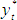
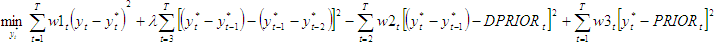
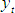
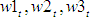
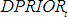

# LRX-фильтр

LRX-фильтр
-

# LRX-фильтр

LRX-фильтр - это метод сглаживания
 временного ряда, который используется для выделения длительных тенденций
 временного ряда и является более общим случаем [фильтра
 Ходрика-Прескотта](UiModelling_HodrickPrescottFilter.htm).

LRX-фильтр вычисляет , минимизируя
 следующую объективную функцию:

Где:

	- . Исходный
	 (моделируемый) ряд;

	- . Сглаженный
	 ряд;

	- λ. Мера гладкости ряда . Может принимать
	 значения в диапазоне [0,001; 100000];

	- . Веса;

	- . Априорные
	 значения;

	- . Априорные
	 разности.

См. также:

[Библиотека методов и моделей](../uimodelling_lib_common.htm)
 | Контейнер моделирования: модель «[LRX-фильтр](UiModelling.chm::/2_Container_of_Modeling/2_3_Work_object/2_3_2_Model/Specification/UiModelling_Specification_LRX.htm)»
 | [IModelling.Lrxf](KeMs.chm::/Interface/IModelling/IModelling.Lrxf.htm)
 | [ISmLRXFilter](StatLib.chm::/Interface/ISmLRXFilter/ISmLRXFilter.htm)

		Справочная
		 система на версию 10.9
		 от 18/08/2025,
		 © ООО «ФОРСАЙТ»,
