# Агрегация (базовая и расширенная)

Агрегация (базовая и расширенная)
-

# Агрегация (базовая и расширенная)

Агрегация - это расчёт данных верхнего уровня на основе данных нижнего
 уровня. Например, данные, рассчитанные по месяцам, суммируются для получения
 квартальных данных.

Расчёт базовой и расширенной агрегации производится на основании данных
 показателей из базы данных временных рядов. Каждый показатель представляет
 собой временной ряд данных. Ряд данных является совокупностью наблюдений
 или точек ряда. Каждое наблюдение характеризуется временем наблюдения
 и его значением, а также рядом дополнительных характеристик, определяемых
 при создании базы данных временных рядов.

При расчёте базовой агрегации входные данные - это временные ряды данных,
 входящие в одну группу агрегации. При расчёте расширенной агрегации входные
 данные - это временной ряд данных, полученный после вычисления заданного
 выражения.

Рассмотрим:

	- временной ряд: TS(TS1,
	 TS2,
	 …, TSn);

	- временной ряд весов: W(W1,
	 W2,
	 …, Wn).

Примечание.
 Если используется функция «Level», то считается, что значение агрегируемого
 временного ряда Y на первый период
 агрегации равно 100, т.е. Y1=100. Значение
 Yt
 на каждый последующий период агрегации, начиная со второго, рассчитывается
 по формуле 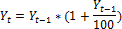 (кроме методов,
 для которых указана отдельная формула).

Доступные методы агрегации:

	- сумма. 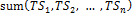

	- взвешенная сумма. 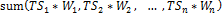

	- среднее. 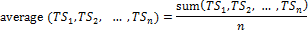

	- взвешенное среднее.
	 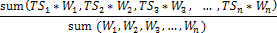

	- среднее, рассчитанное по процентному
	 изменению. 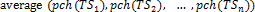

Если используется функция «Level»:
 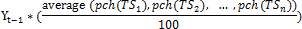

	- взвешенное среднее, рассчитанное
	 по процентному изменению. 

Если используется функция «Level»:
 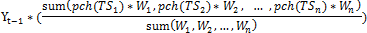

	- среднее, рассчитанное по логарифмической
	 разности. 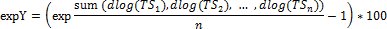

Если используется функция «Level»:
 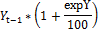

	- взвешенное среднее, по логарифмической
	 разности. 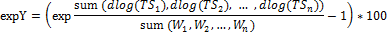

Если используется функция «Level»:
 

	- [медиана](../05_Statistics/UiModelling_Median.htm).
	 

	- [медиана](../05_Statistics/UiModelling_Median.htm), рассчитанная по процентному изменению.
	 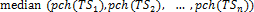

Если используется функция «Level»:
 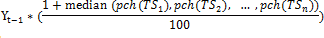

	- [мода](../05_Statistics/UiModelling_mode.htm).
	 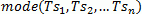

	- взвешенное среднее геометрическое.
	 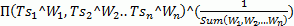, где Π - это произведение;

	- процентиль. Задается
	 процент от 0 до 100. Пустые значения исключаются из расчета агрегации.
	 Значения всех рядов, по которым считается агрегация, на каждый момент
	 времени ранжируются по возрастанию. В зависимости от заданного значения
	 процента выбираются значения соответственного ранга за каждый период,
	 которые будут результатом расчета агрегации. Если процентиль равна
	 0, метод возвращает пустые значения.

	Соответствующий ранг рассчитывается по формуле: Rang = Round(p*N), где:

	-

		- Round.
		 Округление в большую сторону;

		- P.
		 Величина процента;

		- N.
		 Количество рядов, для которых считается агрегация;

	- веса. Основано на выражении,
	 которое учитывает веса всех компонентов, удовлетворяющих выражению
	 агрегации и имеющих данные.

	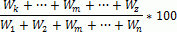

	В числителе k, m,
	 z - номера тех элементов,
	 которые имеют данные. В знаменателе - сумма всех весов.

	- количество наблюдений.
	 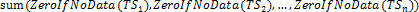, где:

	-

		- ZeroIfNoData(TSi) = 1. Если наблюдение
		 TSi
		 содержит данные;

		- ZeroIfNoData(TSi) = 0. Если наблюдение
		 TSi
		 не содержит данных;

	- количество пропусков.
	 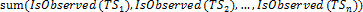, где:

	-

		- IsObserved(TSi) = 0. Если наблюдение TSi
		 содержит данные;

		- IsObserved(TSi) = 1. Если наблюдение TSi
		 не содержит данных;

	- релевантность структуры.
	 Агрегация с учетом пропусков в данных. Рассчитывается следующим образом:

	-

		- задается набор рядов «Блок сравнения»;

		- задается пороговое значение (в диапазоне от 0 до 100);

		- если сумма значений элементов «Блок сравнения», разделенная
		 на сумму всех агрегируемых значений, больше порогового значения,
		 то агрегация рассчитывается, если меньше порогового значения -
		 не рассчитывается.

См. также:

Контейнер моделирования: модели
 «[Агрегация
 (базовая)](UiModelling.chm::/2_Container_of_Modeling/2_3_Work_object/2_3_2_Model/Specification/aggregation/UiModelling_Aggregation_Attr.htm)», «[Агрегация
 (расширенная)](UiModelling.chm::/2_Container_of_Modeling/2_3_Work_object/2_3_2_Model/Specification/aggregation/UiModelling_Aggregation_Attr_CrossDim.htm)» | Анализ временных рядов: [агрегация
 (расширенная)](UiDw.chm::/Workbook/CalculatedSeries/Aggregation/UiDw_cs_Aggregation.htm)

		Справочная
		 система на версию 10.9
		 от 18/08/2025,
		 © ООО «ФОРСАЙТ»,
