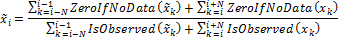
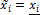
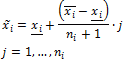
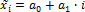
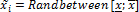
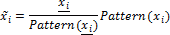
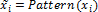

# Обработка пропусков

Обработка пропусков
-

# Обработка пропусков

Обработка пропусков заполняет пустые значения ряда с помощью различных
 методов обработки пропусков.

Пусть имеется M наблюдений
 {x1, x2, …, xM}
 ряда данных X. Некоторые наблюдения
 пропущены, т.е. соответствующие им xi не содержат
 данных. Пропуски могут содержаться в любом месте: в начале выборки, в
 конце, идти по одному или состоять из непрерывной серии пропущенных наблюдений.

Введем следующие обозначения:

	- M.
	 Общее число значений в выборке;

	- i.
	 Номер наблюдения в исходной выборке, i
	 = 1, …, M;

	- m.
	 Число непустых значений в выборке;

	- x.
	 Минимальное значение ряда;

	- x̄.
	 Максимальное значение ряда;

	- xi.
	 Непустое предшествующее значение, ближайшее к пропущенному xi;

	- x̄i.
	 Непустое последующее значение, ближайшее к пропущенному xi;

	- ni.
	 Число пропусков, находящихся между xi
	 и *x̄*i;

	- ZeroIfNoData(xi) = xi.
	 Если наблюдение xi содержит данные;

	- ZeroIfNoData(xi) = 0. Если наблюдение
	 xi
	 не содержит данных;

	- IsObserved(xi) = 1. Если наблюдение xi содержит
	 данные;

	- IsObserved(xi) = 0. Если наблюдение xi не содержит
	 данных.

Используемые методы:

	- среднее
	 значение по выборке. Пропущенные значения заполняются средним
	 арифметическим по непустым значениям выборки:

*

	- среднее по N соседним точкам.
	 Пропуски заполняются средним арифметическим по N
	 ближайшим непустым значениям вперед и назад:

Если интервал вычисления среднего выходит
 за границы массива, среднее считается по имеющимся наблюдениям;

	- предыдущее значение.
	 Пропуски заполняются предыдущими непустыми значениями:

	- следующее значение.
	 Пропуски заполняются следующими непустыми значениями:

	- линейная интерполяция.
	 Пропуски между соседними непустыми значениями заполняются пропорционально
	 по правилу:

	- линейный
	 тренд. Предполагается, что наблюдения исходного ряда имеют
	 линейную зависимость от своего порядкового номера. На основании этого
	 предположения строится регрессия исходного тренда ряда по имеющимся
	 данным. Затем пропуски заполняются согласно оцененной зависимости:

где a0, a1 – оцененные коэффициенты линейного
 тренда;

	- произвольное
	 значение. Пропуски заполняются произвольными значениями из
	 диапазона [x; x̅]:

где [Randbetween](KeMs.chm::/Interface/IModelling/IModelling.Randbetween.htm)
 - это функция, генерирующая случайные значения из заданного диапазона;

	- сasewise.
	 При таком методе обработки пропусков, в вычислениях участвуют только
	 те наблюдения из массива исходных данных, которые не содержат пропусков;

	- геометрическая
	 интерполяция. Пропуски заполняются по следующей формуле:

	- указанное
	 значение. Пропуски заполняются заданным значением A;

	- интерполяция
	 кубическим сплайном. Заполнение пропусков осуществляется с
	 помощью кубических сплайнов. Вычисление кубических сплайнов описано
	 в разделе «[Интерполяция](UiModelling_Interpolation.htm)»;

	- по
	 шаблону. В качестве шаблона используется вспомогательный ряд
	 без пропусков. Пропуски в исходном ряде заполняются пропорционально
	 изменению значений в шаблонном ряде (Pattern):

	- значениями
	 заданного ряда. В качестве шаблона используется вспомогательный
	 ряд без пропусков (Pattern).
	 Пропуски в исходном ряде заполняются значениями из шаблонного
	 ряда:

	- темп
	 роста к указанному числу следующих периодов:

	-

		- один период: x(t) = x(t+1)/(1+pch(x(t+1)));

		- два периода: x(t) = x(t+1)/(1+average(pch(x(t+2)),pch(x(t+3))));

		- от трех до n периодов:
		 x(t) = x(t+1)/(1+Average(pch(x(t+2)),pch(x(t+3)),pch(
		 x(t+4)),…pch(x(t+n))).

Где: pch(x(t))=(x(t)/x(t-1)-1)*100;

	- темп
	 роста к указанному числу предыдущих периодов:

	-

		- один период: x(t)
		 = x(t-1)/(1+pch(x(t-1)));

		- два периода: x(t)
		 = x(t-1)/(1+average(pch(x(t-2)), pch(x(t-3))));

		- от трех до n
		 периодов: x(t)=x(t-1)/(1+Average(pch(x(t-2)),
		 pch(x(t-3)),pch( x(t-4)),…pch(x(t-n)))).

Где: pch(x(t))=(x(t)/x(t-1)-1)*100.

## Особенности методов обработки пропусков

Метод «Геометрическая интерполяция»
 может оставлять пропуски в обработанном ряде, если значения xi и x̄*i
 имеют разных знаков или хотя бы одно из них равно нулю.

Методы обработки пропусков «Значениями
 заданного ряда» и «По шаблону»
 могут оставлять пропуски, если в качестве заданного ряда используется
 ряд с пропусками (пустой ряд).

Методы «Темп роста к указанному числу
 следующих периодов» и «Темп роста
 к указанному числу предыдущих периодов» могут оставлять пропуски,
 если в указанном диапазоне последующих/предыдущих периодов, на основе
 которого рассчитывается темп роста, также содержатся пропуски.

См. также:

Контейнер моделирования: модель
 «[Заполнение
 пропусков](UiModelling.chm::/2_Container_of_Modeling/2_3_Work_object/2_3_2_Model/Specification/UiModelling_Specification_Working_Lost.htm)» | Анализ временных рядов: [обработка
 пропусков](UiDw.chm::/Workbook/CalculatedSeries/Transformations/UiDw_cs_MissingData_Geometric.htm) | [IModelling.Fill](KeMs.chm::/Interface/IModelling/IModelling.Fill.htm)
 | [ISmFillGapsProcedure](StatLib.chm::/Interface/ISmFillGapsProcedure/ISmFillGapsProcedure.htm)

		Справочная
		 система на версию 10.9
		 от 18/08/2025,
		 © ООО «ФОРСАЙТ»,
