# Интерполяция

Интерполяция
-

# Интерполяция

	Интерполяция - это способ нахождения промежуточных значений величины
     по имеющемуся дискретному набору известных значений.

	Интерполяция использует значения некоторой функции, заданные в ряде
	 точек, чтобы предсказать значения функции между ними. Перечисленные ниже
     методы предназначены для создания ряда с более высокой частотой наблюдений
     на основе ряда с низкой частотой. Например, вычислить ряд с квартальной
     динамикой на основе ряда годовых данных.

	Предположим, что есть система несовпадающих точек xi(i ϵ 0, 1, …, N) из некоторой области G.
 Значения функции f известны только
 в этих точках: yi = f(xi),
 i = 1, …, N.

Процесс интерполяции состоит в поиске такой функции f
 из заданного класса функций, что F(xi) = yi,
  i = 1, …, N.

Точки xi
 являются узлами интерполяции, а их совокупность - интерполяционной сеткой.

Пары (xi, yi)
 являются точками данных (базовыми точками).

Разность между «соседними» значениями ∆xi = xi -xi - 1  - называют
 шагом интерполяционной сетки. Шаг может быть переменным или постоянным.

Функцию F(x)
 - интерполирующей функцией (интерполянтой).

## Линейная интерполяция

При линейной интерполяции существующие точки данных М(xi,
 yi)
 (i = 0, 1, ..., n)
 соединяются прямыми линиями и функция f(x) приближается к
 ломаной с вершинами в данных точках.

Уравнения каждого отрезка ломаной линии в общем случае разные. Поскольку
 имеется n интервалов (xi, xi+1), то для
 каждого из них в качестве уравнения интерполяционного полинома используется
 уравнение прямой, проходящей через две точки. В частности, для i-го
 интервала можно написать уравнение прямой, проходящей через точки (xi,
 yi)
 и (xi+1,
 yi+1),
 в виде:

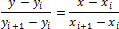

Отсюда:

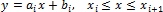

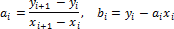

## Геометрическая интерполяция

При геометрической интерполяции значения результирующей динамики пропорциональны
 значению инкремента и обратно пропорциональны фактору, вычисленному на
 основе инкремента. Инкремент экспоненциально зависит от логарифма относительного
 прироста исходной динамики, умноженного на длину периода результирующей
 динамики.

Рассмотрим принцип геометрического метода на примере вычисления квартальных
 данных на основе годовых.

	- X[t]
	 – исходные данные по годам;

	- Inc[t] = exp(log(X[t+1] / X[t]) / 4)
	 – значение инкремента;

	- Factor[t] = (1 + Inc[t] + Inc[t]^2 + Inc[t]^3) / 4
	 – значение фактора;

	- X[t,1], X[t,2], X[t,3], X[t,4]
	 – квартальные данные в год t.

Из этого следует:

	- X[t,1] = X[t] / Factor[t];

	- X[t,2] = X[t] * Inc[t] / Factor[t];

	- X[t,3] = (X[t] * Inc[t]^2) / Factor[t];

	- X[t,4] = (X[t] * Inc[t]^3) / Factor[t].

Интерполяция для других динамик осуществляется аналогичным образом.

## Интерполяция кубическими сплайнами

Сплайны позволяют эффективно решать задачи обработки экспериментальных
 зависимостей между параметрами, имеющих достаточно сложную структуру.
 Наиболее широкое практическое применение, в силу их простоты, нашли кубические
 сплайны. Основные идеи теории кубических сплайнов сформировались в результате
 попыток математически описать гибкие рейки из упругого материала (механические
 сплайны), которыми издавна пользовались чертежники в тех случаях, когда
 возникала необходимость проведения через заданные точки достаточно гладкой
 кривой. Известно, что рейка из упругого материала, закрепленная в некоторых
 точках и находящаяся в положении равновесия, принимает форму, при которой
 ее энергия является минимальной. Это фундаментальное свойство позволяет
 эффективно использовать сплайны при решении практических задач обработки
 экспериментальной информации.

В общем случае для функции y = f(x)
 требуется найти приближение y = ϕ(x) таким образом, чтобы f(xi) = ϕ(xi) в точках x = xi,
 а в остальных точках отрезка [a, b] значения функций f(x) и ϕ(x)
 были близкими между собой. При малом числе экспериментальных точек (например,
 6-8) для решения задачи интерполяции можно использовать один из методов
 построения интерполяционных полиномов. Однако при большом числе узлов
 интерполяционные полиномы становятся практически непригодными. Это связано
 с тем, что степень интерполяционного полинома лишь на единицу меньше числа
 экспериментальных значений функций. Можно, конечно, отрезок, на котором
 определена функция, разбить на участки, содержащие малое число экспериментальных
 точек, и для каждого из них построить интерполяционные полиномы. Однако
 в этом случае аппроксимирующая функция будет иметь точки, где производная
 не является непрерывной, т.е. график функции будет содержать точки
 «излома».

Кубические сплайны лишены этого недостатка. Исследования теории балок
 показали, что гибкая тонкая балка между двумя узлами достаточно хорошо
 описывается кубическим полиномом, и поскольку она не разрушается, то аппроксимирующая
 функция должна быть, по меньшей мере, непрерывно дифференцируемой. Это
 означает, что функции ϕ(x), ϕ'(x), ϕ''(x)
 должны быть непрерывными на отрезке [a, b].

Кубическим интерполяционным сплайном, соответствующим данной функции
 f(x)
 и данным узлам xi, называется функция S(x), удовлетворяющая следующим условиям:

	- на каждом сегменте [xi-1,
	 xi],
	 i = 1, 2, ..., n
	 функция S(x)
	 является полиномом третьей степени;

	- функция S(x),
	 а также ее первая и вторая производные непрерывны на отрезке [a, b];

	- S(xi) = f(x),
	 i = 0,
	 1, ..., n.

На каждом из отрезков [xi-1,
 xi],
 i = 0, 1, ..., n
 находится функция S(x) = Si(x) в виде полинома третьей
 степени:

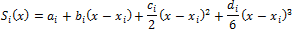

Условие непрерывности всех производных до второго порядка записываются
 в виде:

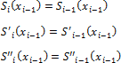

Условие интерполяции:

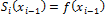

ai, bi, ci, di
 - коэффициенты сплайна, подлежащие определению на всех n
 элементарных отрезках:

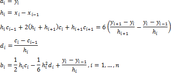

Граничные условия сплайна c0 и cn:

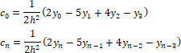

Если функция f(x)
 является полиномом третьей или меньше степени, данные воспроизводятся
 более точно, если граничные условия сплайна c0 и cn равны точным
 значениям второй производной кубического полинома.

## Интерполяция многочленом Лагранжа

Интерполяционный многочлен Лагранжа - это многочлен минимальной степени,
 который принимает данные значения в данном наборе точек. Для n + 1
 пар чисел (x0, y0), (x1, y1), …, (xn, yn),
 где все xi
 различны (i = 0, 1, ..., n), существует единственный многочлен
 L(x)
 степени не более n, для которого
 L(xi) = yi.

В самом простом случае (n =
 1) - это линейный многочлен и его график - прямая, проходящая через две
 заданные точки.

Лагранж предложил методику вычисления подобных многочленов:

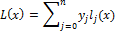

Где базисные полиномы определяются по следующей формуле:

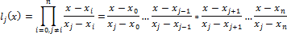

lj(x) обладают свойствами:

	- являются многочленами степени n;

	- lj(xj)=
	 1;

	- lj(xi)
	 = 0 при i ≠ j.

Из этого следует, что L(x), как линейная комбинация lj(x), может иметь степень не больше
 n, и L(xj)
 = yj.

## Полиноминальная интерполяция

Полиномиальная интерполяция является наиболее известным из методов одномерной
 интерполяции. Её достоинствами являются простота реализации и хорошее
 качество получаемых интерполянтов.

Данный метод представляет полином n-ой
 степени P0, 1, …, n-1, n, проходящий
 через n точек (с 0-ой по n-ую), как функцию двух полиномов
 n-1-ой степени по формуле:

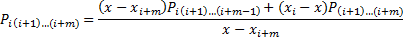

К полученным полиномам рекурсивно применяется та же формула, до тех
 пор, пока мы не дойдем до полиномов вида Pi, которые
 вычисляются по формуле Pi = yi.

Достоинством данного метода является простота реализации, недостатком
 - сравнительно невысокое быстродействие.

## Равномерная интерполяция

Значение исходного ряда делится на число наблюдений, попадающих в один
 период результирующего ряда. Полученное значение присваивается всем наблюдениям
 нового ряда, в пределах одного периода.

## Повторная интерполяция

Значения исходного ряда повторяются на всех наблюдениях ряда с более
 высокой частотой динамики.

## Интерполяция по шаблону

Пусть Input - входной ряд,
 Output - выходной ряд, Pattern - шаблонный ряд. Обозначим
 за t текущую дату входного ряда,
 а за n - количество точек выходного
 ряда в одном периоде.

Рассмотрим три метода интерполяции по шаблону:

	- среднее по элементам

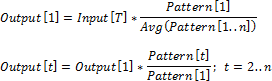

	- по первому элементу

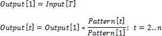

	- по последнему элементу

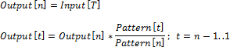

## Первое значение

Значение первой точки результирующей динамики будет совпадать со значением
 точки на исходной динамике. Значения в остальных точках результирующей
 динамики остаются пустыми.

## Последнее значение

Значение последней точки результирующей динамики будет совпадать со
 значением точки на исходной динамике. Значения в остальных точках результирующей
 динамики остаются пустыми.

См. также:

Контейнер моделирования: модель
 «[Интерполяция](UiModelling.chm::/2_Container_of_Modeling/2_3_Work_object/2_3_2_Model/Specification/UiModelling_Specification_Interpolation.htm)»
 | Анализ временных рядов: «[Интерполяция](UiDw.chm::/Workbook/CalculatedSeries/Aggregation/UiDw_cs_ProportionalInterpolation.htm)» |
 [IModelling.Interpolate](KeMs.chm::/Interface/IModelling/IModelling.Interpolate.htm)
 | [IModelling.InterpolateP](KeMs.chm::/Interface/IModelling/IModelling.InterpolateP.htm)

		Справочная
		 система на версию 10.9
		 от 18/08/2025,
		 © ООО «ФОРСАЙТ»,
