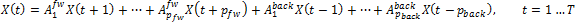
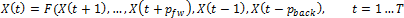

# Система разностных уравнений

Система разностных уравнений
-

# Система разностных уравнений

Обыкновенное разностное уравнение устанавливает связь между значениями функции X = X(y), рассматриваемой для ряда равноотстоящих значений аргумента y. Можно без ограничения общности считать, что искомая функция определена для равноотстоящих значений аргумента с шагом, равным единице. В таких случаях аргумент принято обозначать «t». Таким образом, если начальное значение аргумента есть t, то ряд его равноотстоящих значений будет: t, t+1, t+2,…; и в обратном направлении: t, t-1, t-2,…. Соответствующие значения функции обозначаются: X(t), X(t+1), X(t+2),…; или Xt, X(t-1), X(t-2),….

Обозначения:

-
X(t) - (k×1). Вектор, описывающий состояние системы в момент времени t;

-
k. Количество переменных.

Динамика системы описывается системой авторегрессионных уравнений, зависящей от типа системы разностных уравнений:

-
линейная система разностных уравнений:

-
нелинейная система разностных уравнений:

Состояние системы в момент времени t зависит от pfw последующих состояний и pback предыдущих состояний.

Требуется найти решение системы X(T) = bT при заданных начальных X(t-1), X(t-2), …, X(t-pback) и конечных X(t+1), X(t+2), …, X(t+pfw) значениях.

Система разворачивается относительно каждой переменной xi(t), i = 1, …, k, t = 1, …, T в систему линейных/нелинейных алгебраических уравнений, к которой применимы стандартные методы поиска решения.

См. также:

[Библиотека методов и моделей](../uimodelling_lib_common.htm) | [ICpLinearDecomposition](KeCp.chm::/Interface/ICpLinearDecomposition/ICpLinearDecomposition.htm) | [ICpNonLinearDecomposition](KeCp.chm::/Interface/ICpNonLinearDecomposition/ICpNonLinearDecomposition.htm)

		Справочная
		 система на версию 10.9
		 от 18/08/2025,
		 © ООО «ФОРСАЙТ»,
