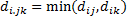
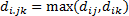
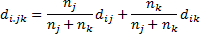
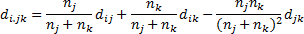
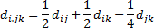
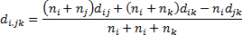
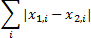
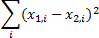
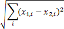

# Иерархический кластерный анализ

Иерархический кластерный анализ
-

# Иерархический кластерный анализ

Иерархический кластерный анализ - метод разбиения множества многомерных
 объектов на однородные группы, относящийся к классу агломеративных методов.
 Агломеративные методы последовательно объединяют отдельные объекты в кластеры.

Исходные данные:

	- n.
	 Число объектов;

	- m.
	 Число признаков;

	- X.
	 Матрица объектов;

	- Q.
	 Искомое число кластеров.

Пусть Х(n x m) - матрица, описывающая n объектов в Rm.
 Алгоритм иерархической кластеризации заключается в последовательном слиянии
 кластеров с минимальным межкластерным расстоянием, начиная с n тривиальных
 кластеров по одному объекту в каждом и заканчивая на шаге n - Q после построения ровно Q кластеров.

Изначально расстояния между однообъектными кластерами – это расстояния
 между соответствующими объектами, и на каждом шаге пересчету подлежит
 только расстояние от вновь образованного кластера посредством слияния
 до оставшихся кластеров.

Межкластерное расстояние и, соответственно, метод пересчета межкластерного
 расстояния между произвольным кластером i
 и кластером, образованным посредством объединения кластеров j, k может быть определен одним из
 способов:

	- ближайший сосед:

	- максимальное расстояние:

	- групповое среднее:

	- центроид:

	- медиана:

	- минимальная вариация:

Где ni,
 nj,
 nk
 - размеры кластеров.

Способы, используемые для определения первоначальных расстояний между
 объектами:

	- сумма модулей:

	- евклидова норма:

	- корень из евклидовой нормы:

См. также:

[Библиотека методов и моделей](../uimodelling_lib_common.htm)
 | [ISmHierarchicalClusterAnalysis](StatLib.chm::/Interface/ISmHierarchicalClusterAnalysis/ISmHierarchicalClusterAnalysis.htm)

		Справочная
		 система на версию 10.9
		 от 18/08/2025,
		 © ООО «ФОРСАЙТ»,
